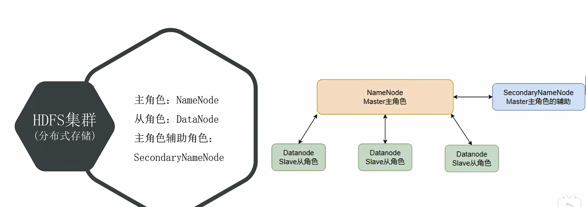

## Hadoop面试题总结（二）——HDFS（Hadoop Distributed System）
### 0、HDFS架构：

### 1、 HDFS 中的 block 默认保存几份？  
&emsp; 默认保存3份 ,储存在不同的服务器上

### 2、HDFS 默认 BlockSize 是多大？  
&emsp; 默认64MB  block块是一个逻辑意义上的概念 

### 3、SecondaryNameNode的目的是什么？  
&emsp; 他的目的使帮助NameNode合并编辑日志，减少NameNode 启动时间。它不是NameNode的备份，但可以作为NameNode的备份，当因为断电或服务器损坏的情况，可以用SecondNameNode中已合并的fsimage文件作为备份文件恢复到NameNode上，但是很有可能丢失掉在合并过程中新生成的edits信息。因此不是完全的备份。
 由于NameNode仅在启动期间合并fsimage和edits文件，因此在繁忙的群集上，edits日志文件可能会随时间变得非常大。较大编辑文件的另一个副作用是下一次重新启动NameNode需要更长时间。SecondNameNode的主要功能是帮助NameNode合并edits和fsimage文件，从而减少NameNode启动时间。

### 4、文件大小设置，增大有什么影响？  
&emsp; HDFS中的文件在物理上是分块存储（block），块的大小可以通过配置参数( dfs.blocksize)来规定，默认大小在hadoop2.x版本中是128M，老版本中是64M。  
&emsp; **思考：为什么块的大小不能设置的太小，也不能设置的太大？**  
&emsp; &emsp; HDFS的块比磁盘的块大，其目的是为了最小化寻址开销。如果块设置得足够大，从磁盘传输数据的时间会明显大于定位这个块开始位置所需的时间。
因而，**传输一个由多个块组成的文件的时间取决于磁盘传输速率**。  
&emsp; 如果寻址时间约为10ms，而传输速率为100MB/s，为了使寻址时间仅占传输时间的1%，我们要将块大小设置约为100MB。默认的块大小128MB。  
&emsp; 块的大小：10ms×100×100M/s = 100M，如图  
  
&emsp; 增加文件块大小，需要增加磁盘的传输速率。  

### 5、hadoop的块大小，从哪个版本开始是128M  
&emsp; 64MB（hadoop1.x）、128MB（hadoop2.x）、256MB(hadoop3.x)  

### 6、HDFS的存储机制（☆☆☆☆☆）  
&emsp; HDFS存储机制，包括HDFS的**写入数据过程**和**读取数据过程**两部分  
&emsp; **HDFS写数据过程**  

  

  

&emsp; 1）客户端通过Distributed FileSystem模块向NameNode请求上传文件，NameNode检查目标文件是否已存在，父目录是否存在。  
&emsp; 2）NameNode返回是否可以上传。（权限检验、检测是否存在该路径）并给出datanode，并更新文件元数据edits  
&emsp; 3）客户端请求第一个 block上传到哪几个datanode服务器上。  
&emsp; 4）NameNode返回3个datanode节点，分别为dn1、dn2、dn3。  
&emsp; 5）客户端通过FSDataOutputStream模块请求dn1上传数据，dn1（局域网内最近的dataNode）收到请求会继续调用dn2，然后dn2调用dn3，将这个通信管道建立完成。  
&emsp; 6）dn1、dn2、dn3逐级应答客户端。  
&emsp; 7）客户端开始往dn1上传第一个block（先从磁盘读取数据放到一个本地内存缓存），以packet为单位，dn1收到一个packet就会传给dn2，dn2传给dn3；
dn1每传一个packet会放入一个应答队列等待应答。  
&emsp; 8）当一个block传输完成之后，客户端再次请求NameNode上传第二个block的服务器。（重复执行3-7步）。  

- **写入一致性**
写入文件的内容不保证立即可见，当前正在写入的块对其他reader不可见。通过hflush()方法后，数据被写入datanode的内存中。可保证对所有reader可见
通过hsync()方法后，数据被写入到磁盘上。如果没有调用hflush()或者hsync()方法。客户端在故障的情况下就会存在数据块丢失

&emsp; **HDFS读数据过程**  

  
  

  

&emsp; 1）客户端通过Distributed FileSystem向NameNode请求下载文件，NameNode通过查询元数据、检验权限，找到文件块所在的Block列表地址。  
&emsp; 2）客户端选择一台DataNode（就近原则，然后随机）服务器，请求读取数据。  
&emsp; 3）DataNode开始传输数据给客户端（从磁盘里面读取数据输入流，以packet为单位来做校验）。  
&emsp; 4）客户端以packet为单位接收，先在本地缓存，然后写入目标文件。  

### 7、secondary namenode工作机制（☆☆☆☆☆）  

  

  

**1）第一阶段：NameNode启动**  
&emsp; （1）第一次启动NameNode格式化后，创建fsimage和edits文件。如果不是第一次启动，直接加载从磁盘中编辑日志edits和镜像文件fsimage到内存。   
&emsp; （2）客户端对元数据进行增删改。   
&emsp; （3）NameNode记录操作日志，更新滚动日志（先写磁盘）。   
&emsp; （4）NameNode在内存中对数据进行增删改查(再写内存)。  
**2）第二阶段：Secondary NameNode工作**  
&emsp; （1）Secondary NameNode询问NameNode是否需要checkpoint。直接带回NameNode是否检查结果。  
&emsp; （2）Secondary NameNode请求执行checkpoint。  
&emsp; （3）NameNode滚动正在写的edits日志。  
&emsp; （4）将滚动前的编辑日志和镜像文件拷贝到Secondary NameNode。  
&emsp; （5）Secondary NameNode加载编辑日志和镜像文件到内存，并合并。  
&emsp; （6）生成新的镜像文件fsimage.chkpoint。  
&emsp; （7）拷贝fsimage.chkpoint到NameNode。  
&emsp; （8）NameNode将fsimage.chkpoint重新命名成fsimage。

### 8、NameNode与SecondaryNameNode 的区别与联系？（☆☆☆☆☆）  
**机制流程看第7题**  
1）区别  
&emsp; （1）NameNode负责管理整个文件系统的元数据，以及每一个路径（文件）所对应的数据块信息。  
&emsp; （2）SecondaryNameNode主要用于定期合并命名空间镜像和命名空间镜像的编辑日志。  
2）联系：  
&emsp; （1）SecondaryNameNode中保存了一份和namenode一致的镜像文件（fsimage）和编辑日志（edits）。  
&emsp; （2）在主namenode发生故障时（假设没有及时备份数据），可以从SecondaryNameNode恢复数据。  

### 9、HDFS组成架构（☆☆☆☆☆）  

  

  

架构主要由四个部分组成，分别为**HDFS Client、NameNode、DataNode和Secondary NameNode**。下面我们分别介绍这四个组成部分。  
1）Client：就是客户端。       
&emsp; （1）文件切分。文件上传HDFS的时候，Client将文件切分成一个一个的Block，然后进行存储；         
&emsp; （2）与NameNode交互，获取文件的位置信息；  
&emsp; （3）与DataNode交互，读取或者写入数据；      
2）NameNode：就是Master，它是一个主管、管理者。  
&emsp; （1）管理HDFS的名称空间；  
&emsp; （2）管理数据块（Block）映射信息；  
&emsp; （3）配置副本策略；  
&emsp; （4）处理客户端读写请求。  
3）DataNode：就是Slave。NameNode下达命令，DataNode执行实际的操作。  
&emsp; （1）存储实际的数据块；  
&emsp; （2）执行数据块的读/写操作。  
4）Secondary NameNode：并非NameNode的热备。当NameNode挂掉的时候，它并不能马上替换NameNode并提供服务。  
&emsp; （1）辅助NameNode，分担其工作量；  
&emsp; （2）定期合并Fsimage和Edits，并推送给NameNode；  
&emsp; （3）在紧急情况下，可辅助恢复NameNode。  

### 10、HAnamenode 是如何工作的? （☆☆☆☆☆）  

  

  

ZKFailoverController主要职责  
&emsp; 1）健康监测：周期性的向它监控的NN发送健康探测命令，从而来确定某个NameNode是否处于健康状态，如果机器宕机，心跳失败，那么zkfc就会标记它处于一个不健康的状态。  
&emsp; 2）会话管理：如果NN是健康的，zkfc就会在zookeeper中保持一个打开的会话，如果NameNode同时还是Active状态的，那么zkfc还会在Zookeeper中占有一个类型为短暂类型的znode，当这个NN挂掉时，这个znode将会被删除，然后备用的NN，将会得到这把锁，升级为主NN，同时标记状态为Active。  
&emsp; 3）当宕机的NN新启动时，它会再次注册zookeper，发现已经有znode锁了，便会自动变为Standby状态，如此往复循环，保证高可靠，需要注意，目前仅仅支持最多配置2个NN。  
&emsp; 4）master选举：如上所述，通过在zookeeper中维持一个短暂类型的znode，来实现抢占式的锁机制，从而判断那个NameNode为Active状态  

