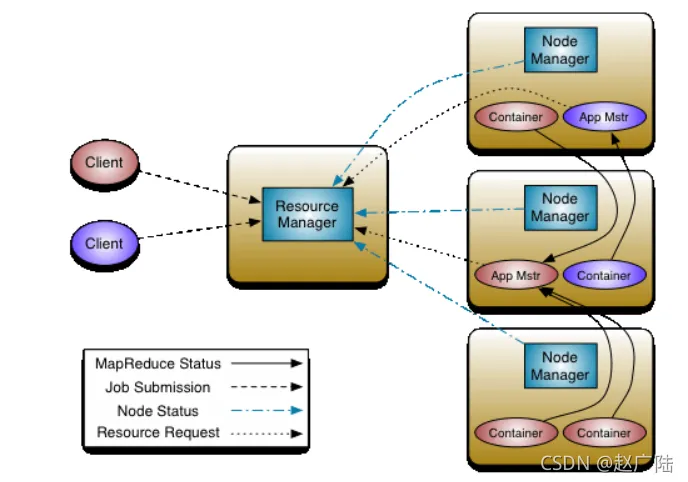

## Hadoop面试题（四）——YARN  

### 1、简述hadoop1与hadoop2 的架构异同  
&emsp; 1）加入了yarn解决了资源调度的问题。  
&emsp; 2）加入了对zookeeper的支持实现比较可靠的高可用。  
    
### 2、为什么会产生 yarn,它解决了什么问题，有什么优势？  
&emsp; 1）Yarn最主要的功能就是解决运行的用户程序与yarn框架完全解耦。  
&emsp; 2）Yarn上可以运行各种类型的分布式运算程序（mapreduce只是其中的一种），比如mapreduce、storm程序，spark程序……  

### 3、HDFS的数据压缩算法?（☆☆☆☆☆）  

&emsp; **企业开发用的比较多的是snappy**。  

### 4、MapReduce 2.0 容错性（☆☆☆☆☆）  
Map Task/Reduce  
&emsp; Task Task周期性向MRAppMaster汇报心跳；一旦Task挂掉，则MRAppMaster将为之重新申请资源，并运行之。最多重新运行次数可由用户设置，默认4次。 

### 5、 Yarn架构

- ResourceManager 负责整个系统的资源管理和分配，ApplicationMaster 负责单个应用程序的的管理

- ApplicationMaster： 用户提交的一个应用程序会对应于一个
ApplicationMaster，它的主要功能与 RM 调度器协商以获得资源，资源以 Container 表示。监控所有的内部任务状态，并在任务运行失败的时候重新为任务申请资源以重启任务。

- NodeManager： NodeManager 是每个节点上的资源和任务管理器，一方面，
它会定期地向 RM 汇报本节点上的资源使用情况和各个 Container 的运行
状态；另一方面，他接收并处理来自 AM 的 Container 启动和停止请求。

- Container： Container 是 YARN 中的资源抽象，封装了各种资源。一个应
用程序会分配一个 Container，这个应用程序只能使用这个 Container 中描述的
资源。

