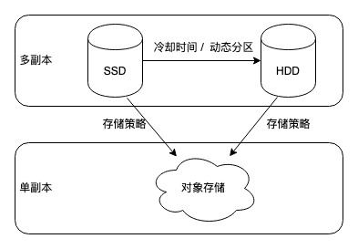

# 《Doris实时数仓实战》笔记

1. ##  Doris
    Doris 是一个为在线分析处理（OLAP）优化的分析型数据库。它设计用来支持高性能、低延迟的实时分析查询。

2. ## Doris 优势
    大规模数据导入使得MYSQL的读性能大大降低，并且可能出现锁表现象。MYSQL在数据量达到2000W这种千万级别时性能很差，只能从产品层面限制用户的查询。MYSQL单表存储数据有限制，随着数据量的增长，Sharding成本飙升。  
具体表现为：
- 原生分布式设计：Doris 是从一开始就设计为一个原生的分布式数据库，它的架构专为分布式环境优化。这包括数据的自动分片和复制、负载均衡、容错和恢复机制等。相比之下，MySQL 的传统架构本质上是单机的。

- 数据分片和复制：Doris 自动将数据分片（Shards）并在多个节点间进行分布，每个分片都可以有多个副本，以提高数据的可靠性和读取性能。这种分片和复制机制内建在 Doris 的核心中，而 MySQL 的分片通常需要外部工具来管理，如 MySQL Fabric。

- 查询优化和执行：Doris 针对分布式环境优化了查询的执行过程：

- 并行查询：Doris 可以自动将一个查询分解并并行地在多个节点上执行，这样可以利用整个集群的计算资源，大幅度提升查询性

- 数据本地性优化：Doris 尽可能在存有数据副本的节点上执行查询，减少数据在网络中的传输，提高查询速度。

- 向量化查询处理：Doris 实现了向量化查询处理，这可以进一步提升处理效率，尤其是在处理大规模数据集时。

- 实时更新与高效导入：Doris 支持实时更新和高效的数据导入。在分布式环境中，它可以实现高吞吐量的数据写入和更新。MySQL 在大规模场景需要复杂的配置和优化才能达到可接受的性能。

3. ## 和hive的区别：
    Hive 适用于与Hadoop集成的场景，处理非结构化或半结构化数据。而 Doris 则适合需要快速、交互式查询的大数据场景。Doris 在查询性能和扩展性上优于 Hive 和 MySQL，尤其是在需要快速响应的大规模分析场景中。Doris 面向OLAP(Online Analytical Processing)，MySQL 面向OLTP(Online Transaction Processing)，而 Hive 更多是批处理和大规模数据分析。

4. ## Doris核心设计：
    **储存引擎（列式存储）**：导致了压缩率极高，并且对于针对于列的查询/修改变得十分高效，磁盘的I/O变低，CPU的计算消耗也变低。  
    1. 对不同的数据类型提供不同的编码方式减少储存空间：  
        - 字典编码：通常用于字符型数据，如字符串和VARCHAR类型。这种编码方式会创建一个“字典”（一个唯一值的列表），每个唯一值在字典中有一个索引。数据中包含多次重复的"China"、"USA"和"India"等值。在字典编码下，这些值会被映射为索引，如"China" -> 0, "USA" -> 1, "India" -> 2。

        - 位图编码：枚举类型较少时，使用位图表示数据的存在性。对于bool值True和False，只有两个枚举：如果列值是[True, False, True, True]，则"True"的位图为1011，"False"的位图为0100。

        - 行程长度编码（Run-Length Encoding, RLE）：表示大量连续重复值的列。在一个列中，如果值[5, 5, 5, 5, 2, 2, 7, 7, 7]连续出现，使用RLE可以表示为(5,4)，(2,2)，(7,3)。

        - 帧重叠编码（Frame-Of-Reference, FOR）：表示值接近的数值型数据。对于数值列[1001, 1005, 1003, 1002]，如果选择最小值1001作为参考，那么存储的数据将是[0, 4, 2, 1]。

    2. 文件格式存储：
    一个数据版本会被分割为多个segment（最大256MB）,每一个segment对应一个物理文件，其中segment通常分为header，data Region ，Index Regin ,Footer几个部分。
        - Data Region（数据页）是数据储存的基本单位，在特定的编码方式下，按列存储，每列被分为多个Page，是Doris的最小数据储存单元。
        - Index Region(索引页) ，索引可以分为智能索引和二级索引。其中智能索引是自动创建，有前缀稀疏索引（每1024项保存一个稀疏索引项，以方便用户快速定位起始行），MIN MAX索引（Page会记录每一个Pages的最大值和最小值，是否有null，是否有空，同样每一个segment也会记录）以范围查询快速过滤；二级索引包括Bloom Filter（在Pages级别快速判断一个值是否存在），bitmap（对于较小枚举值个数的列快速定位/过滤）

    3. 查询引擎：在doris中聚合算子被拆分为两级聚合：第一级聚合是数据所在节点；第二级聚合将Key相同的数据汇总到同一节点，进行最终的聚合。  
    在Runtime Filter优化中，对于join算子，我们将右表称为BuildTable（构建表），左表称为ProbeTable（探测表），先读取右表数据，构建一个hashtable于内存，然后读左表的每一个数据并且于hashtable中进行连接匹配，返回符合连接条件的数据。通常左表数据量会大于右表数据量。

    4. 查询优化器：

    - 常量折叠：预先对常量进行计算。

    - 子查询改写为join，从而利用Doris在Join算子上优化来提升效率。

    - 谓词下推。使得可以穿透查询层到达存储层。

    - 自动调整join顺序，减少join中间表的大小。

    - 向量化执行引擎：直接分批获取数据，对于列式存储的系统非常友好（例如将age列的数据都加1），而不是传统的迭代模型，需要调用next（）获得一行数据，然后再获得对应的列（age）再运算操作，大大的提高了效率。

5.  ## FE&BE
    在Doris中FE（frontend）是基于java编写，负责管理系统的元数据，包括数据库的模式信息、表结构、用户权限等。的而BE(backend)是基于C++，负责数据的物理存储和处理。

- BE执行由 FE 下发的查询执行计划，包括数据的过滤、聚合、排序等操作。BE 管理其本地资源，包括内存、磁盘IO和网络。

- FE 管理整个 Doris 集群的配置和状态，包括 BE 节点的添加、删除和负载均衡。

- 按照Greenplum和ClickHouse数据库推荐的分布方式，数据平均分不到了各个节点，可能集群达几十台，上百台，任何表中的数据都需要切成几十分之一，并且任何一次查询都需要所有的主节点参与计算和数据交互，会浪费大量网络资源，也不利于提高查询并发能力。如果对于80%的小表，每个节点保存一份数据。数据膨胀和同步的瓶颈很难被突破。而Doris是基于分桶数来分不数据的，支持用户根据不同的表设置不同的分桶数（hash%block_num）,将数据随机分布在部分节点上。 其中分区是逻辑意义上的，而分桶则是物理意义上的。 

6. ## Doris数据模型：
    Column可以分为Key（维度）和Value（指标）

- duplicate模型：允许表中存在重复的键值对，即相同的主键（Key）可以有多行记录。这个模型不做任何去重或聚合。适用于需要保留所有原始数据且不进行去重和聚合的场景，如日志记录、事件跟踪等。

- Aggregate 模型：相同主键的数据行会被聚合在一起。你可以指定聚合函数（如 SUM、MIN、MAX、REPLACE）来定义聚合规则。适用于需要预先计算和存储聚合数据的场景，如报表生成、统计分析等。通过预查询，可以极大减少查询的时间。

- Unique 模型：相同主键的数据行会被更新，表中的主键是唯一的。这类似于传统关系数据库中的主键约束。适用于需要确保数据唯一性并支持更新的场景，如用户信息、配置表等。但无法利用rollup的优势。但因为unique的key比较少，所以数据合并速度会高于aggregate模型。所以在数据写场景多的时候，可以考虑使用unique。有两种实现方式：  
**读时合并 (merge-on-read)**。在读时合并实现中，用户在进行数据写入时不会触发任何数据去重相关的操作，所有数据去重的操作都在查询或者 compaction 时进行。因此，读时合并的写入性能较好，查询性能较差，同时内存消耗也较高。  
**写时合并 (merge-on-write)**。在 1.2 版本中，引入了写时合并实现，该实现会在数据写入阶段完成所有数据去重的工作，因此能够提供非常好的查询性能。自 2.0 版本起，写时合并已经非常成熟稳定，由于其优秀的查询性能，我们推荐大部分用户选择该实现。自 2.1 版本，写时合并成为 Unique 模型的默认实现。

7. ## 表数据存储

    Doris是参照ORCFile格式存储的。ORCFile是基于RCFile（Record Columnar File）文件格式的，并在此上面做了一些优化，在其结构的基础上引申出Stripe和footer。每一个ORC文件会被横向切分为多个Stripe，然后每一个Stripe内部按列存储。一般等于HDFS大小，256MB。
    
    数据块采用**列存储**，这样select a from table，只会I/O对应物理存储的一行（对应table的a列）并且采用游程编码，相同的数据不会重复储存。并采用懒加载策略，在hive读数据的时候才会进行解压缩，但会跳过不需要查询的列（例如不符合where条件的列）。 

    读取ORC文件是从尾部开始的，第一次读取16KB的大小，尽可能的将Postscript和Footer数据都读入内存。Postscript中保存着整个文件的元数据信息，如文件的压缩格式，同时，Footer信息也被读取，它包含了每一个stripe的长度和偏移量，文件的schema信息，然后，处理每一个stripe。每个stripe被分为index和data两部分，内部是按照row group（索引的最小单位，一个stripe中包含多个row group，默认为10000个值组成）进行分块的，row group内部按列存储。每一个row group由多个stream保存数据和索引信息。

9. ## 分区与分桶--二级数据划分（均为物理划分）

    分区一般为日期字段。粗粒度划分。必须为key列，且不能为String类型。当不使用分区建表时，系统会自动生成一个和表名同名的，全值范围的分区。该分区对用户不可见，并且不可删改。对于动态分区，适用于分区列的时间数据随现实世界同步增长的情况。Doris FE 中有固定的 dynamic partition 控制线程，持续以特定时间间隔（dynamic_partition_check_interval_seconds）进行 dynamic partition 表的分区检查，完成需要的分区创建与删除操作；对于自动分区，主要解决了用户预期基于某列对表进行分区操作时，但该列的数据分布比较零散或者难以预测，在建表或调整表结构时难以准确创建所需分区，或者分区数量过多以至于手动创建过于繁琐的问题。Doris 禁止自动分区（Auto Partition）和动态分区（Dynamic Partition）同时作用于一张表上，会导致逻辑不清晰。

    分桶目的是为了负载均衡和提高并发，细粒度划分。一个 Tablet 只属于一个分区。而一个分区包含若干个 Tablet。因为 Tablet 在物理上是独立存储的，所以可以视为分区在物理上也是独立。Tablet 是数据移动、复制等操作的最小物理存储单元

    查询不包含分桶列的等值条件，会吞吐增加，延时降低，适合大吞吐、低并发场景。

    查询仅选择一个/较少分桶列，当多查询并发时候，大概率会选择不同的分桶进行扫描，各个查询之间影响较小，适合高并发场景。

9. ## 查询优化

    查看执行计划：Desc graph(图形化)、Explain（过滤条件）、Desc verbose（展示执行列信息）

    查询优化器：

    - 词法（找出keyWord）、语法解析（判断命令是否正确）。

    - 语义解析（校验元数据：表名，列名等）。

    - Query改写（根据优化器内置的规则来改写）

    - 单机执行计划规划（Join Order：调整join顺序，减少笛卡尔积大小、谓词下推：过滤条件（谓词）尽可能地下推到查询计划的更早阶段，减少数据量）

    - 生成分布式执行计划，选择合适的join操作；并且可以分布式聚合：先对本地数据进行汇总（group by id），由于相同id的数据可能不在同一个节点上，所以会进行hash重分布（reshuffle），使得相同的数据会被分配到同一个节点上，再进行聚合，最后再汇总到一个节点上。  
    数据重分布（或称为reshuffle）通过基于哈希值的重分布，可以尽量保证每个节点处理的数据量大致相同，避免某些节点成为瓶颈，从而提高整体查询性能。如果不进行数据重分布，在全局汇总时，汇总节点会接受所有局部汇总结果，使得计算量过大，成为系统瓶颈；虽然数据重分布会涉及一定的网络带宽，但因为局部汇总后的数据已经足够小，多个节点承担一部分的汇总工作再交给全局汇总节点这种方法在仅仅提高一些带宽的情况下显著减少了汇总节点的负担，可以提高系统性能。

10. ## 索引

- 智能索引（内置）

    - 前缀索引:Doris中数据以SStable（sort string table）有序的数据结构存储，前缀索引以Block为粒度创建稀疏索引，一个Block包括1024行数据，每个Block以第一行数据的前缀列的值为索引。数据块一行数据的前 36 个字节作为这行数据的前缀索引。当遇到 VARCHAR 类型时，前缀索引会直接截断。如果第一列即为 VARCHAR，那么即使没有达到 36 字节，也会直接截断。创建表时，应将常用字段防止于靠前以建立前缀索引加快查询速度。

    - ZoneMap索引：索引是在列存格式上，对每一列自动维护的索引信息，包括 Min/Max，null 值个数等等。在数据查询时，会根据范围条件过滤的字段按照 ZoneMap 统计信息选取扫描的数据范围。

- 二级索引

    - 布隆过滤器索引（BloomFilter Index）：快速判断某个元素是否属于集合，但是并不严格要求 100% 正确的场合。对于一个元素检测是否存在的调用，BloomFilter 会告诉调用者两个结果之一：可能存在或者一定不存在。BloomFilter 索引也是以 Block 为粒度创建的。每个 Block 中，指定列的值作为一个集合生成一个 BloomFilter 索引条目，用于在查询时快速过滤不满足条件的数据。
    
    - 位图索引（Bitmap Index）：对列的每个键值建立一个位图，相对于其它索引，占用的存储空间非常小，创建和使用非常快，缺点是修改操作锁粒度大，不适合频繁更新。建议在 100 到 100,000 之间，如：职业、地市。Bitmap 索引仅在单列上创建。Bitmap 索引能够应用在 Duplicate、Uniq 数据模型的所有列和 Aggregate模型的 key 列上。

    - NGram Bloomfilter：NGram指的是将文本切割成长度为N的子串（n-grams）。Bloomfilter是一种空间效率非常高的概率型数据结构，用于测试一个元素是否属于一个集合。通过NGram方法，将文本字符串分割成多个小的子字符串（通常长度为n）。 将这些子字符串通过哈希函数映射到一个大型位数组中。这个位数组是布隆过滤器存储结构。查询时，通过相同的NGram和哈希函数来确定某个子字符串是否存在集合中，虽然布隆过滤器可能会有一定的误判概率（即可能会说某个元素存在集合中，但实际上并不存在）。假设我们有文本字符串“hello world”，并且我们用二元NGram（即N=2）hello world” 被分割成：he, el, ll, lo, o , wo, or, rl, ld这些二元n-grams被通过哈希函数映射到布隆过滤器中。查询字符串“orld”： 首先分割成二元n-grams：or, rl, ld。通过哈希函数检查这些子串是否在布隆过滤器中，如果所有都匹配，则认为“orld”是存在的。NGram Bloomfilter有一定的误判概率，但不会漏报（即可能会判断存在但实际不存在，不会判断不存在但实际存在）。NGram Bloomfilter在空间效率和子字符串匹配上有优势。通常越大过滤效果越好，可以从 256 开始进行验证测试看看效果。当然字节数越大也会带来索引存储、内存 cost 上升。

    - 倒排索引：记录了每个词（或短语）在文档集合中出现的位置。假设我们有两个文档： Doc1: "hello world"Doc2: "hello there"构建倒排索引后，索引可能如下："hello" -> [Doc1, Doc2]"world" -> [Doc1] "there" -> [Doc2]。倒排索引提供精确的文档定位，不存在误判。倒排索引在精确查询和全文检索上表现更佳。

11.  ## 推荐规约:

- VARCHAR:变长字符串，长度范围为：1-65533 字节长度，以 UTF-8 编码存储的，因此通常英文字符占 1 个字节，中文字符占 3 个字节。varchar(255) 和 varchar(65533) 的性能问题，这二者如果存的数据是一样的，性能也是一样的，建表时如果不确定这个字段最大有多长，建议直接使用 65533 即可，防止由于字符串过长导致的导入问题。

- STRING:变长字符串，默认支持 1048576 字节（1MB），可调大到 2147483643 字节（2G），以 UTF-8 编码存储的，因此通常英文字符占 1 个字节，中文字符占 3 个字节。只能用在 Value 列，不能用在 Key 列和分区分桶列。适用于一些比较大的文本存储，一般如果没有这种需求的话，建议使用 VARCHAR，STRING 列无法用在 Key 列和分桶列，局限性比较大。

- 时间字段：这里需要注意的是，如果有高精度（毫秒值时间戳）需求，需要指明使用 datetime(6)，否则默认是不支持毫秒值时间戳的。

- 建议使用 JSON 数据类型代替字符串类型存放 JSON 数据的使用方式。

