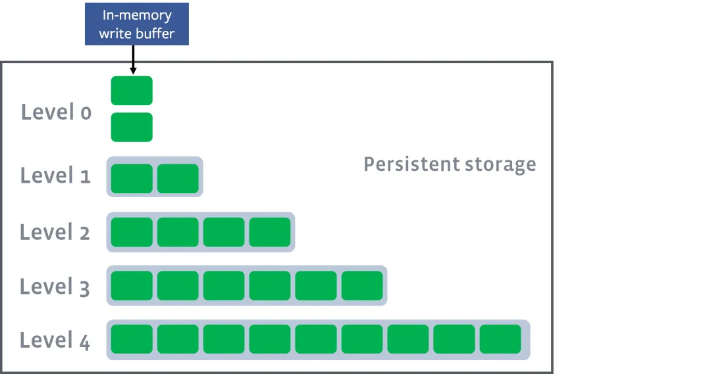

<style>
h1 {font-size: 2.5rem;}
h2 {font-size: 2rem;}
h3 {font-size: 1.8rem;}
p {font-size: 1.5rem;}
 ol, li {font-size: 1.5rem;} /* 设置有序列表和列表项的字体大小 */
</style>
# 《Doris实时数仓实战》笔记

## 1. Doris

  &emsp; Doris 是一个为在线分析处理（OLAP）优化的分析型数据库。它设计用来支持高性能、低延迟的实时分析查询。

##  2. Doris 优势
  &emsp; 大规模数据导入使得MYSQL的读性能大大降低，并且可能出现锁表现象。MYSQL在数据量达到2000W这种千万级别时性能很差，只能从产品层面限制用户的查询。MYSQL单表存储数据有限制，随着数据量的增长，Sharding成本飙升。  
具体表现为：
- 原生分布式设计：Doris 是从一开始就设计为一个原生的分布式数据库，它的架构专为分布式环境优化。这包括数据的自动分片和复制、负载均衡、容错和恢复机制等。相比之下，MySQL 的传统架构本质上是单机的。

- 数据分片和复制：Doris 自动将数据分片（Shards）并在多个节点间进行分布，每个分片都可以有多个副本，以提高数据的可靠性和读取性能。这种分片和复制机制内建在 Doris 的核心中，而 MySQL 的分片通常需要外部工具来管理，如 MySQL Fabric。

- 查询优化和执行：Doris 针对分布式环境优化了查询的执行过程：

- 并行查询：Doris 可以自动将一个查询分解并并行地在多个节点上执行，这样可以利用整个集群的计算资源，大幅度提升查询性

- 数据本地性优化：Doris 尽可能在存有数据副本的节点上执行查询，减少数据在网络中的传输，提高查询速度。

- 向量化查询处理：Doris 实现了向量化查询处理，这可以进一步提升处理效率，尤其是在处理大规模数据集时。

- 实时更新与高效导入：Doris 支持实时更新和高效的数据导入。在分布式环境中，它可以实现高吞吐量的数据写入和更新。MySQL 在大规模场景需要复杂的配置和优化才能达到可接受的性能。

##  3.  和hive的区别：
  &emsp; Hive 适用于与Hadoop集成的场景，处理非结构化或半结构化数据。而 Doris 则适合需要快速、交互式查询的大数据场景。Doris 在查询性能和扩展性上优于 Hive 和 MySQL，尤其是在需要快速响应的大规模分析场景中。Doris 面向OLAP(Online Analytical Processing)，MySQL 面向OLTP(Online Transaction Processing)，而 Hive 更多是批处理和大规模数据分析。

 ## 4. Doris核心设计：
 
  **储存引擎（列式存储）**：导致了压缩率极高，并且对于针对于列的查询/修改变得十分高效，磁盘的I/O变低，CPU的计算消耗也变低。  
  1. 对不同的数据类型提供不同的编码方式减少储存空间：  
      - 字典编码：通常用于字符型数据，如字符串和VARCHAR类型。这种编码方式会创建一个“字典”（一个唯一值的列表），每个唯一值在字典中有一个索引。数据中包含多次重复的"China"、"USA"和"India"等值。在字典编码下，这些值会被映射为索引，如"China" -> 0, "USA" -> 1, "India" -> 2。

      - 位图编码：枚举类型较少时，使用位图表示数据的存在性。对于bool值True和False，只有两个枚举：如果列值是[True, False, True, True]，则"True"的位图为1011，"False"的位图为0100。

      - 行程长度编码（Run-Length Encoding, RLE）：表示大量连续重复值的列。在一个列中，如果值[5, 5, 5, 5, 2, 2, 7, 7, 7]连续出现，使用RLE可以表示为(5,4)，(2,2)，(7,3)。

      - 帧重叠编码（Frame-Of-Reference, FOR）：表示值接近的数值型数据。对于数值列[1001, 1005, 1003, 1002]，如果选择最小值1001作为参考，那么存储的数据将是[0, 4, 2, 1]。

  2. 文件格式存储：
  一个数据版本会被分割为多个segment（最大256MB）,每一个segment对应一个物理文件，其中segment通常分为header，data Region ，Index Regin ,Footer几个部分。
      - Data Region（数据页）是数据储存的基本单位，在特定的编码方式下，按列存储，每列被分为多个Page，是Doris的最小数据储存单元。
      - Index Region(索引页) ，索引可以分为智能索引和二级索引。其中智能索引是自动创建，有前缀稀疏索引（每1024项保存一个稀疏索引项，以方便用户快速定位起始行），MIN MAX索引（Page会记录每一个Pages的最大值和最小值，是否有null，是否有空，同样每一个segment也会记录）以范围查询快速过滤；二级索引包括Bloom Filter（在Pages级别快速判断一个值是否存在），bitmap（对于较小枚举值个数的列快速定位/过滤）

  3. 查询引擎：在doris中聚合算子被拆分为两级聚合：第一级聚合是数据所在节点；第二级聚合将Key相同的数据汇总到同一节点，进行最终的聚合。  
    在Runtime Filter优化中，对于join算子，我们将右表称为BuildTable（构建表），左表称为ProbeTable（探测表），先读取右表数据，构建一个hashtable于内存，然后读左表的每一个数据并且于hashtable中进行连接匹配，返回符合连接条件的数据。通常左表数据量会大于右表数据量。

  4. 查询优化器：

  - 常量折叠：预先对常量进行计算。

  - 子查询改写为join，从而利用Doris在Join算子上优化来提升效率。

  - 谓词下推。使得可以穿透查询层到达存储层。

  - 自动调整join顺序，减少join中间表的大小。

  - 向量化执行引擎：直接分批获取数据，对于列式存储的系统非常友好（例如将age列的数据都加1），而不是传统的迭代模型，需要调用next（）获得一行数据，然后再获得对应的列（age）再运算操作，大大的提高了效率。

 ## 5.  FE&BE
  &emsp; 在Doris中FE（frontend）是基于java编写，负责管理系统的元数据，包括数据库的模式信息、表结构、用户权限等。的而BE(backend)是基于C++，负责数据的物理存储和处理。

- BE执行由 FE 下发的查询执行计划，包括数据的过滤、聚合、排序等操作。BE 管理其本地资源，包括内存、磁盘IO和网络。

- FE 管理整个 Doris 集群的配置和状态，包括 BE 节点的添加、删除和负载均衡。

- 按照Greenplum和ClickHouse数据库推荐的分布方式，数据平均分不到了各个节点，可能集群达几十台，上百台，任何表中的数据都需要切成几十分之一，并且任何一次查询都需要所有的主节点参与计算和数据交互，会浪费大量网络资源，也不利于提高查询并发能力。如果对于80%的小表，每个节点保存一份数据。数据膨胀和同步的瓶颈很难被突破。而Doris是基于分桶数来分不数据的，支持用户根据不同的表设置不同的分桶数（hash%block_num）,将数据随机分布在部分节点上。 其中分区是逻辑意义上的，而分桶则是物理意义上的。 

 ## 6. Doris数据模型：

  Column可以分为Key（维度）和Value（指标）

- duplicate模型：允许表中存在重复的键值对，即相同的主键（Key）可以有多行记录。这个模型不做任何去重或聚合。适用于需要保留所有原始数据且不进行去重和聚合的场景，如日志记录、事件跟踪等。

- Aggregate 模型：相同主键的数据行会被聚合在一起。你可以指定聚合函数（如 SUM、MIN、MAX、REPLACE）来定义聚合规则。适用于需要预先计算和存储聚合数据的场景，如报表生成、统计分析等。通过预查询，可以极大减少查询的时间。

- Unique 模型：相同主键的数据行会被更新，表中的主键是唯一的。这类似于传统关系数据库中的主键约束。适用于需要确保数据唯一性并支持更新的场景，如用户信息、配置表等。但无法利用rollup的优势。但因为unique的key比较少，所以数据合并速度会高于aggregate模型。所以在数据写场景多的时候，可以考虑使用unique。有两种实现方式：  
**读时合并 (merge-on-read)**。在读时合并实现中，用户在进行数据写入时不会触发任何数据去重相关的操作，所有数据去重的操作都在查询或者 compaction 时进行。因此，读时合并的写入性能较好，查询性能较差，同时内存消耗也较高。  
**写时合并 (merge-on-write)**。在 1.2 版本中，引入了写时合并实现，该实现会在数据写入阶段完成所有数据去重的工作，因此能够提供非常好的查询性能。自 2.0 版本起，写时合并已经非常成熟稳定，由于其优秀的查询性能，我们推荐大部分用户选择该实现。自 2.1 版本，写时合并成为 Unique 模型的默认实现。

## 7.  表数据存储

  &emsp; Doris是参照ORCFile格式存储的。ORCFile是基于RCFile（Record Columnar File）文件格式的，并在此上面做了一些优化，在其结构的基础上引申出Stripe和footer。每一个ORC文件会被横向切分为多个Stripe，然后每一个Stripe内部按列存储。一般等于HDFS大小，256MB。
    
  &emsp; 数据块采用**列存储**，这样select a from table，只会I/O对应物理存储的一行（对应table的a列）并且采用游程编码，相同的数据不会重复储存。并采用懒加载策略，在hive读数据的时候才会进行解压缩，但会跳过不需要查询的列（例如不符合where条件的列）。 

  &emsp; 读取ORC文件是从尾部开始的，第一次读取16KB的大小，尽可能的将Postscript和Footer数据都读入内存。Postscript中保存着整个文件的元数据信息，如文件的压缩格式，同时，Footer信息也被读取，它包含了每一个stripe的长度和偏移量，文件的schema信息，然后，处理每一个stripe。每个stripe被分为index和data两部分，内部是按照row group（索引的最小单位，一个stripe中包含多个row group，默认为10000个值组成）进行分块的，row group内部按列存储。每一个row group由多个stream保存数据和索引信息。

## 8.  分区与分桶--二级数据划分（均为物理划分）

  &emsp; 分区一般为日期字段。粗粒度划分。必须为key列，且不能为String类型。当不使用分区建表时，系统会自动生成一个和表名同名的，全值范围的分区。该分区对用户不可见，并且不可删改。对于动态分区，适用于分区列的时间数据随现实世界同步增长的情况。Doris FE 中有固定的 dynamic partition 控制线程，持续以特定时间间隔（dynamic_partition_check_interval_seconds）进行 dynamic partition 表的分区检查，完成需要的分区创建与删除操作；对于自动分区，主要解决了用户预期基于某列对表进行分区操作时，但该列的数据分布比较零散或者难以预测，在建表或调整表结构时难以准确创建所需分区，或者分区数量过多以至于手动创建过于繁琐的问题。Doris 禁止自动分区（Auto Partition）和动态分区（Dynamic Partition）同时作用于一张表上，会导致逻辑不清晰。

  &emsp; 分桶目的是为了负载均衡和提高并发，细粒度划分。一个 Tablet 只属于一个分区。而一个分区包含若干个 Tablet。因为 Tablet 在物理上是独立存储的，所以可以视为分区在物理上也是独立。Tablet 是数据移动、复制等操作的最小物理存储单元

  &emsp; 查询不包含分桶列的等值条件，会吞吐增加，延时降低，适合大吞吐、低并发场景。

  &emsp; 查询仅选择一个/较少分桶列，当多查询并发时候，大概率会选择不同的分桶进行扫描，各个查询之间影响较小，适合高并发场景。

 ## 9. 查询优化

  查看执行计划：Desc graph(图形化)、Explain（过滤条件）、Desc verbose（展示执行列信息）

  查询优化器：

  - 词法（找出keyWord）、语法解析（判断命令是否正确）。

  - 语义解析（校验元数据：表名，列名等）。

  - Query改写（根据优化器内置的规则来改写）

  - 单机执行计划规划（Join Order：调整join顺序，减少笛卡尔积大小、谓词下推：过滤条件（谓词）尽可能地下推到查询计划的更早阶段，减少数据量）

  - &emsp;生成分布式执行计划，选择合适的join操作；并且可以分布式聚合：先对本地数据进行汇总（group by id），由于相同id的数据可能不在同一个节点上，所以会进行hash重分布（reshuffle），使得相同的数据会被分配到同一个节点上，再进行聚合，最后再汇总到一个节点上。  
  数据重分布（或称为reshuffle）通过基于哈希值的重分布，可以尽量保证每个节点处理的数据量大致相同，避免某些节点成为瓶颈，从而提高整体查询性能。如果不进行数据重分布，在全局汇总时，汇总节点会接受所有局部汇总结果，使得计算量过大，成为系统瓶颈；虽然数据重分布会涉及一定的网络带宽，但因为局部汇总后的数据已经足够小，多个节点承担一部分的汇总工作再交给全局汇总节点这种方法在仅仅提高一些带宽的情况下显著减少了汇总节点的负担，可以提高系统性能。

 ## 10. 索引

- 智能索引（内置）

    - 前缀索引:Doris中数据以SStable（sort string table）有序的数据结构存储，前缀索引以Block为粒度创建稀疏索引，一个Block包括1024行数据，每个Block以第一行数据的前缀列的值为索引。数据块一行数据的前 36 个字节作为这行数据的前缀索引。当遇到 VARCHAR 类型时，前缀索引会直接截断。如果第一列即为 VARCHAR，那么即使没有达到 36 字节，也会直接截断。创建表时，应将常用字段防止于靠前以建立前缀索引加快查询速度。

    - ZoneMap索引：索引是在列存格式上，对每一列自动维护的索引信息，包括 Min/Max，null 值个数等等。在数据查询时，会根据范围条件过滤的字段按照 ZoneMap 统计信息选取扫描的数据范围。

- 二级索引

    - 布隆过滤器索引（BloomFilter Index）：快速判断某个元素是否属于集合，但是并不严格要求 100% 正确的场合。对于一个元素检测是否存在的调用，BloomFilter 会告诉调用者两个结果之一：可能存在或者一定不存在。BloomFilter 索引也是以 Block 为粒度创建的。每个 Block 中，指定列的值作为一个集合生成一个 BloomFilter 索引条目，用于在查询时快速过滤不满足条件的数据。
    
    - 位图索引（Bitmap Index）：对列的每个键值建立一个位图，相对于其它索引，占用的存储空间非常小，创建和使用非常快，缺点是修改操作锁粒度大，不适合频繁更新。建议在 100 到 100,000 之间，如：职业、地市。Bitmap 索引仅在单列上创建。Bitmap 索引能够应用在 Duplicate、Uniq 数据模型的所有列和 Aggregate模型的 key 列上。

    - NGram Bloomfilter：NGram指的是将文本切割成长度为N的子串（n-grams）。Bloomfilter是一种空间效率非常高的概率型数据结构，用于测试一个元素是否属于一个集合。通过NGram方法，将文本字符串分割成多个小的子字符串（通常长度为n）。 将这些子字符串通过哈希函数映射到一个大型位数组中。这个位数组是布隆过滤器存储结构。查询时，通过相同的NGram和哈希函数来确定某个子字符串是否存在集合中，虽然布隆过滤器可能会有一定的误判概率（即可能会说某个元素存在集合中，但实际上并不存在）。假设我们有文本字符串“hello world”，并且我们用二元NGram（即N=2）hello world” 被分割成：he, el, ll, lo, o , wo, or, rl, ld这些二元n-grams被通过哈希函数映射到布隆过滤器中。查询字符串“orld”： 首先分割成二元n-grams：or, rl, ld。通过哈希函数检查这些子串是否在布隆过滤器中，如果所有都匹配，则认为“orld”是存在的。NGram Bloomfilter有一定的误判概率，但不会漏报（即可能会判断存在但实际不存在，不会判断不存在但实际存在）。NGram Bloomfilter在空间效率和子字符串匹配上有优势。通常越大过滤效果越好，可以从 256 开始进行验证测试看看效果。当然字节数越大也会带来索引存储、内存 cost 上升。

    - 倒排索引：记录了每个词（或短语）在文档集合中出现的位置。假设我们有两个文档： Doc1: "hello world"Doc2: "hello there"构建倒排索引后，索引可能如下："hello" -> [Doc1, Doc2]"world" -> [Doc1] "there" -> [Doc2]。倒排索引提供精确的文档定位，不存在误判。倒排索引在精确查询和全文检索上表现更佳。

 ## 11.  推荐规约:

- VARCHAR:变长字符串，长度范围为：1-65533 字节长度，以 UTF-8 编码存储的，因此通常英文字符占 1 个字节，中文字符占 3 个字节。varchar(255) 和 varchar(65533) 的性能问题，这二者如果存的数据是一样的，性能也是一样的，建表时如果不确定这个字段最大有多长，建议直接使用 65533 即可，防止由于字符串过长导致的导入问题。

- STRING:变长字符串，默认支持 1048576 字节（1MB），可调大到 2147483643 字节（2G），以 UTF-8 编码存储的，因此通常英文字符占 1 个字节，中文字符占 3 个字节。只能用在 Value 列，不能用在 Key 列和分区分桶列。适用于一些比较大的文本存储，一般如果没有这种需求的话，建议使用 VARCHAR，STRING 列无法用在 Key 列和分桶列，局限性比较大。

- 时间字段：这里需要注意的是，如果有高精度（毫秒值时间戳）需求，需要指明使用 datetime(6)，否则默认是不支持毫秒值时间戳的。

- 建议使用 JSON 数据类型代替字符串类型存放 JSON 数据的使用方式。
## 12.缓存
### 需求场景
&emsp;大部分数据分析场景是写少读多，数据写入一次，多次频繁读取，比如一张报表涉及的维度和指标，数据在凌晨一次性计算好，但每天有数百甚至数千次的页面访问，因此非常适合把结果集缓存起来。在数据分析或 BI（Business Intelligence，商业智能） 应用中，存在下面的业务场景：

- 高并发场景，Doris 可以较好的支持高并发，但单台服务器无法承载太高的 QPS复杂图表的看板。
- 复杂的 Dashboard 或者大屏类应用，数据来自多张表，每个页面有数十个查询，虽然每个查询只有数十毫秒，但是总体查询时间会在数秒

- 趋势分析，给定日期范围的查询，指标按日显示，比如查询最近 7 天内的用户数的趋势，这类查询数据量大，查询范围广，查询时间往往需要数十秒

- 用户重复查询，如果产品没有防重刷机制，用户因手误或其他原因重复刷新页面，导致提交大量的重复的 SQL

以上四种场景，在应用层的解决方案，把查询结果放到 Redis 中，周期性的更新缓存或者用户手工刷新缓存，但是这个方案有如下问题：

- 数据不一致，无法感知数据的更新，导致用户经常看到旧的数据

- 命中率低，缓存整个查询结果，如果数据实时写入，缓存频繁失效，命中率低且系统负载较重

- 额外成本，引入外部缓存组件，会带来系统复杂度，增加额外成本
### 解决方案
本分区缓存策略可以解决上面的问题，优先保证数据一致性，在此基础上细化缓存粒度，提升命中率，因此有如下特点：

- 用户无需担心数据一致性，通过版本来控制缓存失效，缓存的数据和从 BE 中查询的数据是一致的

- 没有额外的组件和成本，缓存结果存储在 BE 的内存中，用户可以根据需要调整缓存内存大小

- 实现了一种缓存策略，SQLCache

- 用一致性哈希解决 BE 节点上下线的问题，BE 中的缓存算法是改进的 LRU。 

***SQL Cache: 只有 SQL 语句完全一致才会命中缓存***

-------------------------------------------------------------------

### 通俗理解分区缓存策略：
&emsp;假设我们有一个销售数据的报表系统，因业务特点每天凌晨会生成固定数据，但用户在白天会频繁地查看这些报表，这时就有了高频查询的需求。

**传统缓存方法（如使用Redis）：**

1. **缓存配置**：
  - 将销售数据的查询结果缓存到Redis中，设置某个时间周期定期刷新（比如每小时刷新一次）。
 
2. **缓存命中率问题**：
  - 由于缓存整个查询结果，对于高并发访问（如某些热点数据），有可能频繁失效。每当数据有更新时，之前缓存的结果就会失效，导致需要重新查询数据库。

3. **数据不一致性**：
  - Redis不一定了解数据的更新情况，如果数据在生成的过程中有所变化，但Redis无法感知时，用户可能会看到旧数据，引发业务上的巨大问题。

针对这些问题，本分区缓存策略有如下方案：
- **缓存细粒度数据：** 数据被分区缓存，而不仅是整条结果缓存。比如，销售数据可以按照日期分区缓存，查询某几天的数据时，可以命中相应的日期分区。
- **版本控制：** 通过版本来控制缓存失效，确保缓存的数据和最新的数据库数据保持一致。
- **高命中率：** 细粒度缓存导致单个数据块更新不会使整个缓存失效，提高了缓存命中率。
- **减少复杂性和成本：** 缓存存储在数据查询服务器（BE - Backend）中，不需要额外的缓存所需组件，如Redis，实现更低的运维复杂度和成本。  


**举个例子具体说明这个缓存策略：**

&emsp;想象你在图书馆做记录，每当新的图书上架时，你在笔记本中记录下书名、作者等信息。那么对于每个查询（比如某天的上架书单），如果你全记在一个页面上，当你需要找特定图书时会很慢。于是，你决定按照书名的首字母来分章节记录，这样当有人查某本书时（如以首字母为A的某本书），你直接翻到对应章节，比全翻一页页找更快，而且更新某书目时也只是改一个章节而不是全部改。这个过程类似分区缓存策略，减小查询和更新的负担。

**为什么传统使用Redis不太好，举个例子：**

假设你开了个餐厅，并且使用Redis缓存来存储菜单。每天早上8点厨房会准备好当天的菜单，并将菜单存到Redis中供服务员取用。
 
1. **数据不一致问题**：
  - 如果厨房临时决定9点加了一道新菜，但是Redis中的菜单没有更新，服务员给顾客的还是老菜单，导致顾客点菜出现问题。

2. **高并发刷新问题**：
  - 高峰时段每一位顾客查看菜单，服务员都会查询Redis，但如果某个小时内需要频繁刷新菜单，随着菜品变动频繁，Redis缓存会频繁失效，导致服务员不得不反复查询数据库，大大增加了系统负载。

3. **额外成本高，复杂度增加**：
  - 维护Redis、设置合适的缓存机制也需要技术成本，增加了系统复杂度。

**分区缓存策略这种场景下：**
- **分区缓存和版本控制，单一部分更新：** 如果把菜品按类型（主菜、甜点、饮料等）分开存储，每次数据更新时仅更新相关部分，顾客点单时也只查询相关部分；
- **内存中直接访问：** 更高效地保证了菜单的实时性和一致性，也不用外局Redis维护。

通过这样优化，使高并发查询性能更高，同时资源消耗更少。


## 13.  Join实现和算子以及一些优化
### Join 实现
-  嵌套循环(Nested Loops Join)原理. 

    **实现方式:** 从驱动表读取数据，然后访问被驱动表进行循环匹配。  
    **适用情况:** 驱动表记录集小（<1000），被驱动表有索引，索引选择性好。

-  归并连接（Sort Merge Join）原理. 

    **实现方式:** 两表根据关联字段排序，然后交替匹配。但因为排序的内存开销很大，当数据量很大时效果比较差。  
    **适用情况:** 数据源已经排序，连接字段没有索引，硬件资源小。

- 哈希连接（Hash Join）原理

    **实现方式:** 利用连接键在内存建立哈希表，探测匹配。  
    **适用情况:** 两表都大，数据无序，硬件资源足够。且必须为等值查询。而且性能比前两个要好。

---------------------------------------------------------------------------
### Nest Loop Join（嵌套循环连接）——原生物理算子
Nest Loop Join 的工作方式就像是从一个列表中逐个检查每一个项来找匹配。具体来说：
1. **两层循环**：外循环遍历左表的每一行，内循环遍历右表的每一行，检查是否符合连接条件。就像每个班级的每个学生都和学校的每门课程进行比对，检查学生是否选了该课程。

2. **特点**：
- 可以用于任何类型的连接（不等值连接，大于，小于等）。通用但性能差，因为每搞定一条数据都要“从头到尾”的全面比对。但时间复杂度是O(M*N)
### Hash Join——原生物理算子
&emsp;在右表上根据等值 Join 列建立哈希表，左表流式的利用哈希表进行 Join 计算，它的限制是只能适用于**等值Join**。像电话簿一样只能查找确切人名。时间复杂度近于O(M)
### Broadcast Join（广播连接）——适合小表很小的情景
&emsp;它要求把右表全量的数据都发送到左表上，即每一个参与 Join 的节点，它都拥有右表全量的数据，也就是 T(R)。它适用的场景是比较通用的，同时能够支持 Hash Join 和 Nest loop Join，它的网络开销 N * T(R)。这种方式就像班级里每个同学都得到了一份学校课程表。具体来说：
1. **右表广播**：把右表的所有数据都发送到每一个左表节点，使每个左表节点都有完整的右表数据。这样每个节点都可以独立完成连接操作。
2. **特点**：适用于右表数据量不大的情况，因为广播的网络开销较大。

### Bucket Shuffle Join--优化
Doris 支持的常规分布式 Join 方式包括了 shuffle join 和 broadcast join。这两种 join 都会导致不小的网络开销：  

举个例子，当前存在 A 表与 B 表的 Join 查询，它的 Join 方式为 HashJoin，不同 Join 类型的开销如下：

**Broadcast Join**: 如果根据数据分布，查询规划出 A 表有 3 个执行的 HashJoinNode，那么需要将 B 表全量的发送到 3 个 HashJoinNode，那么它的网络开销是3B，它的内存开销也是3B。

**Shuffle Join**: Shuffle Join 会将 A，B 两张表的数据根据哈希计算分散到集群的节点之中，所以它的网络开销为 A + B，内存开销为B。  但可以优化成Bucket Shuffle Join或者Colocation Join。

**Bucket Shuffle Join**，它的网络开销则是：T（R）相当于只 Shuffle 右表的数据就可以了。

&emsp;确定 Build Table 以及 Probe Table：Build Table 使用 join key 构建 Hash Table，而 Probe Table 使用 join key 进行探测，探测成功就可以 join 在一起。通常情况下，小表会作为 Build Table，旨在减少hash confliction与构建的 Hash Table 最好能全部加载在内存，效率最高，而大表作为 Probe Table。

在 FE 之中保存了 Doris 每个表的数据分布信息，如果 join 语句命中了表的数据分布列，我们应该使用数据分布信息来减少 join 语句的网络与内存开销，这就是 Bucket Shuffle Join 的思路来源。

&emsp;上面的图片展示了 Bucket Shuffle Join 的工作原理。SQL 语句为 A 表 join B 表，并且 join 的等值表达式命中了 A 的数据分布列。而 Bucket Shuffle Join 会根据 A 表的数据分布信息，将 B 表的数据发送到对应的 A 表的数据存储计算节点。Bucket Shuffle Join 开销如下：

网络开销： B < min(3B, A + B)

内存开销： B <= min(3B, B)

&emsp;可见，相比于 Broadcast Join 与 Shuffle Join，Bucket Shuffle Join 有着较为明显的性能优势。减少数据在节点间的传输耗时和 Join 时的内存开销。相对于 Doris 原有的 Join 方式，它有着下面的优点

&emsp;首先，Bucket-Shuffle-Join 降低了网络与内存开销，使一些 Join 查询具有了更好的性能。尤其是当 FE 能够执行左表的分区裁剪与桶裁剪时。

&emsp;其次，同时与 Colocate Join 不同，它对于表的数据分布方式并没有侵入性，这对于用户来说是透明的。对于表的数据分布没有强制性的要求，不容易导致数据倾斜的问题。

**但只生效于 Join 条件为等值的场景，因为依赖hash确定数据分布**

### Colocation Join
- Colocation Group（CG）：一个 CG 中会包含一张及以上的 Table。在同一个 Group 内的 Table 有着相同的 Colocation Group Schema，并且有着相同的数据分片分布。

- Colocation Group Schema（CGS）：用于描述一个 CG 中的 Table，和 Colocation 相关的通用 Schema 信息。包括分桶列类型，分桶数以及副本数等。  

&emsp;Colocation Join 旨在为某些 Join 查询提供本地性优化，来减少数据在节点间的传输耗时，加速查询。是将一组拥有相同 CGS的 Table 组成一个 CG。并保证这些 Table 对应的数据分片会落在同一个 BE 节点上。使得当 CG 内的表进行分桶列上的 Join 操作时，可以通过直接进行本地数据 Join，减少数据在节点间的传输耗时。  
&emsp;同一 CG 内的 Table 必须保证以下属性相同：**分桶列和分桶数、副本数**。这样就保证了，分桶列值相同的数据都在同一个 BE 节点上，可以进行本地数据 Join。

### Semi Join 半连接
对于左半连接（left Semi Join）当条件满足时，返回左表数据，与left join不同的是，如果右表存在多条满足的数据，不会返回多条。换句话说它是**in**、**exists**的底层实现。

### Anti Join 反连接
是Semi Join的反逻辑，也是**not in、not exists**的底层实现。
## 14. 物化视图

&emsp;在没有物化视图功能之前，用户一般都是使用 **Rollup** 功能通过预聚合方式提升查询效率的。但是 Rollup 具有一定的局限性，他不能基于明细模型做预聚合。物化视图既支持动态刷新数据，又满足高效查询需求。  
一个好的物化视图，让多个查询都可以匹配到这张物化视图；在实际的分析查询中，并不会覆盖到所有的维度分析（与Rollup对比）。所以给常用的维度组合创建物化视图即可，从而到达一个空间和时间上的平衡。**可以用于计算UV（Unique Visitor）和PV（Page View）。**  
例子：
``` sql
create materialized view store_amt as select store_id, sum(sale_amt) from sales_records group by store_id;
```

**创建物化视图是异步的操作——需要检查是否完成。**
```sql
SHOW ALTER TABLE MATERIALIZED VIEW FROM db_name
```
物化视图支持不同刷新策略，如**定时刷新**和**手动刷新**或者**触发式刷新**。
### 物化视图的自动匹配


&emsp;候选集过滤目前分为4层，每一层过滤后去除不满足条件的物化视图。
例如： 查询7月19日各个销售员都买了多少钱。 首先一开始候选集中包括所有的物化视图以及Base表共4个。 第一层 过滤先判断查询Where中的谓词涉及到的数据是否能从物化视图中得到，也就是销售时间列是否在表中存在。由于第三个物化视图中根本不存在销售时间列。所以在这一层过滤中，mv_3就被淘汰了。 第二层 是过滤查询的分组列是否为候选集的分组列的子集，也就是 销售员id 是否为表中分组列的子集。由于第二个物化视图中的分组列并不涉及 销售员id 。所以在这一层过滤中，mv_2也被淘汰了。 第三层 过滤是看查询的聚合列是否为候选集中聚合列的子集，也就是对销售额求和是否能从候选集的表中聚合得出。这里Base表和物化视图表均满足标准。 最后一层 是过滤看查询需要的列是否存在于候选集合的列中。由于候选集合中的表均满足标准，所以最终候选集合中的表为 销售明细表 ，以及 mv_1 这两张。  


候选集过滤完后输出一个集合，这个集合中的所有表都能满足查询的需求，但每张表的查询效率都不同。
这时候就需要在这个集合根据**前缀索引**是否能匹配到，以及聚合程度的高低来选出一个最优的物化视图。
例如： 从表结构中可以看出，Base表的销售日期列是一个非排序列，而物化视图表的日期是一个排序列，同时聚合程度上mv_1表明显比Base表高。
所以最后选择出mv_1作为该查询的最优匹配。


最后再根据选择出的最优解，改写查询。


另一个改写的例子：


## 15. 高效去重
### bitmap精准去重
亿级别以上 bitmap 大基数的交并集计算性能较差。排查后端 be 的 bitmap 聚合函数逻辑，发现主要有两个原因。
一是当 bitmap 基数较大时，如 bitmap 大小超过 1g，网络/磁盘 IO 处理时间比较长；
二是后端 be 实例在 scan 数据后全部传输到顶层节点进行求交和并运算，给顶层单节点带来压力，成为处理瓶颈。
解决思路是**将 bitmap 列的值按照 range 划分**，不同 range 的值存储在不同的分桶中，保证了不同分桶的 bitmap 值是正交的。当查询时，先分别对不同分桶中的正交 bitmap 进行聚合计算，然后顶层节点直接将聚合计算后的值合并汇总，并输出。如此会大大提高计算效率，解决了顶层单节点计算瓶颈问题。

具体操作：建表，增加 hid 列，表示 bitmap 列值 id 范围，作为 hash 分桶列。使数据 hash 分桶尽量均衡，hid数设置至少是 BUCKETS 的 5 倍以上。

```sql
CREATE TABLE `user_tag_bitmap` (
  `tag` bigint(20) NULL COMMENT "用户标签",
  `hid` smallint(6) NULL COMMENT "分桶id",
  `user_id` bitmap BITMAP_UNION NULL COMMENT ""
) ENGINE=OLAP
AGGREGATE KEY(`tag`, `hid`)
COMMENT "OLAP"
DISTRIBUTED BY HASH(`hid`) BUCKETS 3
```

对用户 bitmap 值 range 范围纵向切割，例如，用户 id 在 1-5000000 范围内的 hid 值相同，hid 值相同的行会分配到一个分桶内，如此每个分桶内到的 bitmap 都是正交的。可以利用桶内 bitmap 值正交特性，进行交并集计算，计算结果会被 shuffle 至 top 节点聚合。

### HLL近似去重
HyperLogLog，下面简称为HLL，它是 LogLog 算法的升级版，作用是能够提供不精确的去重计数。
它通过哈希函数将输入的元素映射到一个固定数量的寄存器，记录**哈希值前导零的最大长度**来估算基数。

存在以下的特点：
- 代码实现较难。
- 能够使用极少的内存来统计巨量的数据，在 Redis 中实现的 HyperLogLog，只需要12K内存就能统计2^64个数据。
- 计数存在一定的误差，误差率整体较低。标准误差为 0.81% 。
- 误差可以被设置辅助计算因子进行降低。

下面我们举下例子：
取 Java 语言来说，一般long占用8字节，而一字节有8位，即：1 byte = 8 bit，即long数据类型最大可以表示的数是：2^63-1。对应上面的2^64个数，假设此时有2^63-1这么多个数，从 0 ~ 2^63-1，按照long以及1k = 1024字节的规则来计算内存总数，就是：((2^63-1) * 8/1024)KB，这是很庞大的一个数，存储空间远远超过12K。而 HyperLogLog 却可以用 12K 就能统计完。

为什么HyperLogLog能够使用极少的内存来统计巨量的数据之前，要先认识下伯努利试验。

硬币拥有正反两面，一次的上抛至落下，最终出现正反面的概率都是50%。假设一直抛硬币，直到它出现正面为止，我们记录为一次完整的试验，间中可能抛了一次就出现了正面，也可能抛了4次才出现正面。无论抛了多少次，只要出现了正面，就记录为一次试验。这个试验就是**伯努利试验**。

那么对于多次的伯努利试验，假设这个多次为$n$次。就意味着出现了$n$次的正面。假设每次伯努利试验所经历了的抛掷次数为$k$。第一次伯努利试验，次数设为$k_1$，以此类推，第$n$次对应的是$k_n$。
其中，对于这$n$次伯努利试验中，必然会有一个最大的抛掷次数k，例如抛了12次才出现正面，那么称这个为$k_{max}$，代表抛了最多的次数。
伯努利试验容易得出有以下结论：

$n$次伯努利过程的投掷次数都不大于 $k_{max}$。
$n$次伯努利过程，至少有一次投掷次数等于 $k_{max}$

最终结合极大似然估算的方法，发现在$n$和$k_{max}$中存在估算关联：$n = 2^{k_{max}}$ 。这种通过局部信息预估整体数据流特性的方法似乎有些超出我们的基本认知，需要用概率和统计的方法才能推导和验证这种关联关系。


#### 推导过程
1. 定义和设定

设我们进行了次数为 $n$ 的伯努利试验，每次试验都是在抛出正面为止的独立试验。
每一次试验需要的抛掷次数分别是

$$
k_1, k_2, \ldots, k_n
$$

其中，

$$
k_{\text{max}}
$$

是这 $n $ 次试验中所需的最大抛掷次数。

2. 概率分布

每次试验都是抛硬币直到出现正面为止，因此每次试验次数 $ k $的概率分布是几何分布，概率为：

$$
P(K = k) = (1 - p)^{k-1} p
$$

其中 \( p = 0.5 \) 是抛硬币出现正面的概率。所以，

$$
P(K = k) = (0.5)^{k}
$$

3. 联合概率

由于 $k_1, k_2, \ldots, k_n $ 是独立的几何分布随机变量，所以它们的联合分布是：

$$
P(k_1, k_2, \ldots, k_n) = \prod_{i=1}^n P(K = k_i) = (0.5)^{\sum_{i=1}^n k_i}
$$
4. 最大值的概括

现在考虑 $ k_{\text{max}} $。对于$ k_{\text{max}} = k $，意味着所有 $ k_i \leq k$且至少有一个 $ k_i = k $。

设 $ M $ 表示采样中最大的投掷次数，那么:

$$
P(M = k) = \binom{n}{1} \cdot (0.5)^k \cdot (1 - (0.5)^k)^{n-1}
$$

因为， $ n $ 次试验每个试验都必须小于等于 $ k $，并且至少有一次是 $ k $。

5. 极大似然估计

我们通过极大似然估计找到 $k $ 的最优值，即最大化上述联合概率。由于$k$ 可以离散变化，我们需要找 $P(M = k)$的最大值。

对 $ k $求对数，然后再求导方便优化：

$$
\log P(M = k) = \log \binom{n}{1} + k \log(0.5) + (n-1) \log (1 - (0.5)^k)
$$

可以利用解析方法或图形的方法，通过观察发现当 $P(M = k) $ 最大时， $k = \log_2 n $。

6. 结论

根据极大似然估计的结果，从而可以推导出 $ n $ 和 $k_{\text{max}} $ 的关系为：

$$
k_{\text{max}} = \log_2 n \quad \text{或者} \quad n = 2^{k_{\text{max}}}
$$

在上面的3组例子中，我们称为一轮的估算。如果只是进行一轮的话，当 $n$ 足够大的时候，估算的误差率会相对减少，但仍然不够小。
那么是否可以进行多轮呢？例如进行 100 轮或者更多轮次的试验，然后再取每轮的 $k_{max}$，再取平均数，即: $k_{mx}/100$。最终再估算出 $n$。下面是LogLog的估算公式：
$$
DV_{LL}=constant*m*2^R
$$
上面公式的DVLL对应的就是$n$，$constant$是修正因子，它的具体值是不定的，可以根据实际情况而分支设置。$m$代表的是试验的轮数。头上有一横的R就是平均数：$(k_{max_1} + ... + k_{max_m})/m$。
这种通过增加试验轮次，再取$k_{max}$平均数的算法优化就是LogLog的做法。而 HyperLogLog和LogLog的区别就是，它采用的不是平均数，而是**调和平均数**。调和平均数比平均数的好处就是不容易受到大的数值的影响。下面举个例子：

A的是1000/月，B的30000/月。采用平均数的方式就是： (1000 + 30000) / 2 = 15500

采用调和平均数的方式就是： 2/(1/1000 + 1/30000) ≈ 1935.484

$$
 H_n = \frac{1}{\frac{1}{n}\sum_{i=1}^{n}\frac{1}{x_i}} = \frac{n}{\sum_{i=1}^{n}\frac{1}{x_i}} 
 $$

其中：
- $ H_n$ 是n个数的调和平均数。
- $x_i $ 表示数据集中的第i个数。
- $ n $ 是数据集中数的个数。

#### 扯上关系
在抛硬币的例子中，可以通过一次伯努利试验中出现的$k_{max}$来估算$n$。

统计APP或网页的一个页面，每天有多少用户点击进入的次数。同一个用户的反复点击进入记为 1 次
通过hash函数，将数据转为比特串，例如输入5，便转为：101。因为要和抛硬币对应上，比特串中，0 代表了反面，1 代表了正面，如果一个数据最终被转化了 10010000，那么从右往左，从低位往高位看，我们可以认为，首次出现 1 的时候，就是正面。

我们可以**通过多次抛硬币实验的最大抛到正面的次数来预估总共进行了多少次实验**，同样也就可以根据存入数据中，**转化后的出现了 1 的最大的位置 $k_{max}$ 来估算存入了多少数据**。

分桶--
分桶就是分多少轮。抽象到计算机存储中去，就是存储的是一个以单位是比特(bit)，长度为 L 的大数组 S ，将 S 平均分为 m 组，注意这个 m 组，就是对应多少轮，然后每组所占有的比特个数是平均的，设为 P，表示该组最长的前导零长度。容易得出下面的关系：
$$
L = S_{length}
$$

$$
L = m * p
$$
以 K 为单位，S 占用的内存M
$$ M=L / 8 / 1024$$

在 Redis 中，HyperLogLog设置为：m=16834，p=6，L=16834 * 6。占用内存为=16834 * 6 / 8 / 1024 = 12K。

可以实现对8字节（64=2^6位）数据的计数

---
现在回到我们的原始APP页面统计用户的问题中去。

设 APP 主页的 key 为： main
用户 id 为：idn , n->0,1,2,3....

在这个统计问题中，不同的用户 id 标识了一个用户，那么我们可以把**用户的 id 作为被hash的输入**。即：

**hash(id) = 比特串**

不同的用户 id，必然拥有不同的比特串。每一个比特串，也必然会至少出现一次 1 的位置。我们类比每一个比特串为一次伯努利试验。

现在要分轮，也就是分桶。所以我们可以设定，每个比特串的前多少位转为2进制后，其值就对应于所在桶的标号。假设比特串的**低两位**用来计算桶下标志，此时有一个用户的id的比特串是：1001011000011。它的所在桶下标为：11(2)= 3(10)，处于第3个桶，即第3轮中。

上面例子中，计算出桶号后，剩下的比特串是：10010110000，从低位到高位看，第一次出现 1 的位置是 5 。也就是说，此时第3个桶，第3轮的试验中，$k_{max}$ = 5。5 对应的二进制是：101，又因为每个桶有 p 个比特位。当 p>=3 时，便可以将 101 存进去。
模仿上面的流程，多个不同的用户id，就被分散到不同的桶中去了，且每个桶有其 $k_{max}$。然后当要统计出页面有多少用户点击量的时候，就是一次估算。最终结合所有桶中的 $k_{max}$，代入估算公式，便能得出估算值。


**可视化模拟**

http://content.research.neustar.biz/blog/hll.html

## 16. LSM-Tree
存储结构可以粗略分为两类：**数据可变**的和**数据不可变**的。所谓可变，就是说已经插入的数据还可以原地进行修改，不可变就是说已经插入的数据就不能再修改了。

B 树是数据可变的代表结构（B+ 树等衍生结构都归为 B 树一族）。B 树的难点在于平衡性维护和并发控制，一般用在读多写少的场景数据存在节点上，我们可以随意插入、删除、修改 BST 中的节点。B 树的理论增删查改性能和 BST 一样都是 logN，但 B 树的实际写入效率并不是特别高，：

一方面是因为 B 树需要分裂合并等操作保证整棵树的平衡性，这里面涉及很多磁盘随机读写的操作，性能会比较差；

另一方面考虑到并发场景，修改 B 树结构时需要比较复杂的锁机制保证并发安全，也会一定程度影响效率。

LSM 树（Log Structured Merge Tree）数据不可变的代表结构。你只能在尾部追加新数据，不能修改之前已经插入的数据。但可以利用墓碑机制实现修改与删除：

我们只需要提供set(key, val)和get(key)两个 API 即可。

查询操作靠get(key)，增删改操作都可以由set(key, val)实现：
如果set的key不存在就是新增键值对，如果已经存在，就是更新键值对；如果把val设置为一个特殊值（比如 null）就可以代表key被删掉了（墓碑机制）。

那么我对某个键key做了一系列操作后，我只要找到最近一次的操作，就能知道这个键当前的值是多少了。

**磁盘角度**：在尾部追加的写入效率非常高，因为不需要像 B 树那样维护复杂的树形结构。但代价是，查找效率肯定比较低，只能通过线性遍历去查找操作记录；同时会空间放大： LSM 树中，如果更新一个键 100 次，就相当于写入了 100 条数据，会消耗更多空间。解决办法话就是**压实（compact）**，把操作序列中失效的历史操作消除掉，只保留最近的操作记录。

**有序性**：有序度越高，读性能越强，但相应的，维护有序性的成本也越高，写入性能也就会越差。B 树实际上维护了所有数据的有序性，读快写慢。LSM 树不可能向 B 树那样维护所有数据的有序性，但可以维护局部数据的有序性，从而一定程度提升读性能。

**结构**：
其中Journal就是log，Entry Log就是若干SSTable的集合。memtable是红黑树或者跳表这样的有序内存数据结构，起到缓存和排序的作用，把新写入的数据按照键的大小进行排序。当memtable到达一定大小之后，会被转化成SSTable格式刷入磁盘持久化存储。

SSTable（Sorted String Table）数据按照键的大小排列，你可以把它类比成一个有序数组。而 LSM 树就是若干SSTable的集合。

log文件记录操作日志，在数据写入memtable的同时也会刷盘写入到log文件，作用是数据恢复。类似于Redis中的AOF文件。等memtable中的数据成功转化成SSTable落盘之后，log文件中对应的操作日志就没必要存在了，可以被删除。LSM 树的set写入过程并不复杂：写入log和memtable，最后转化成一个SSTable持久化到磁盘就行了。

**Compact**:比较常用的方案是按照层级组织SSTable:

每个绿色方块代表一个SSTable，若干个SSTable构成一层，总共有若干层，每层能够容纳的SSTable数量上限依次递增。新刷入的SSTable在第 0 层，如果某一层的SSTable个数超过上限，则会触发 compact 操作，从该层选出若干SSTable合并成一个更大的SSTable，移动下一层：

每个SSTable就好比一个有序数组/链表，多个SSTable的合并就是合并多个有序链表的逻辑，所以越靠上层的数据越新，越靠下层的数据越旧，且算法保证同一层的若干SSTable的key不存在重叠。


对于查询key27，只需要从上到下遍历层，每层中使用二分查找寻找可能包含key27的SStable，然后使用Boolmfilter快速判断是否存在。这样就避免了使用线性时间查找目标key。

### 17 数据导入
- **Stream Load**：Doris用户最常用的数据导入方式之一，它是一种同步的导入方式, 允许用户通过Http访问的方式将CSV格式或JSON格式的数据批量地导入Doris，并返回数据导入的结果。用户可以直接通过Http请求的返回体判断数据导入是否成功，也可以通过在客户端执行查询SQL来查询历史任务的结果。

    用户将Stream Load的Http请求提交给FE，FE会通过 Http 重定向（Redirect）将数据导入请求转发给某一个BE节点，该BE节点将作为本次Stream Load任务的Coordinator。在这个过程中，接收请求的FE节点仅仅提供**转发**服务，由作为 Coordinator的BE节点实际负责整个导入作业，比如负责向Master FE发送事务请求、从FE获取导入执行计划、接收实时数据、分发数据到其他Executor BE节点以及数据导入结束后返回结果给用户。
    
    用户也可以将Stream Load的Http请求直接提交给某一个指定的BE节点，并由该节点作为本次Stream Load任务的Coordinator。在Stream Load过程中，Executor BE节点负责将数据写入存储层。


Doris通过事务（Transaction）来保证数据导入的原子性，一次Stream Load任务对应一个事务。Stream Load的事务管理由FE负责，FE通过FrontendService接收Coordinator BE节点发送来的Thrift RPC事务请求，事务请求类型包括Begin Transaction、Commit Transaction和Rollback Transaction。Doris的事务状态包括：PREPARE、COMMITTED、VISIBLE和ABORTED。

1. **Begin Transaction（隔离性）**:
  - **请求**: 数据导入开始时，Coordinator BE向FE发送Begin Transaction请求。
  - **检查**: FE检查请求的label是否已存在。
    - 如果不存在，则创建新事务，分配Transaction Id，将事务状态设置为PREPARE，并返回成功信息。
    - 如果已存在，则视为重复请求，返回失败信息，任务退出。

2. **Commit Transaction（持久性）**:
  - **请求**: 数据写入磁盘完成后，Coordinator BE向FE发送Commit Transaction请求。
  - **检查**: FE检查每个Tablet成功写入数据的副本数量是否超过其总数的一半。**多数派原则**（quorum）。
    - 如果满足条件，Commit Transaction成功，状态设置为COMMITTED，但数据还不可见，需执行Publish Version。
    - 如果不满足条件，返回失败信息。

3. **Publish Version（一致性）**:
  - **操作**: FE通过Thrift RPC向所有相关Executor BE节点发出Publish Version请求，各节点异步执行任务。
  - **状态更新**:
    - 所有Publish Version任务成功后，事务状态变为VISIBLE。
    - 任务失败时，FE会重复下发请求直至成功或超时。
    - 超时后，事务状态为COMMITTED，但数据依然不可见，需用户执行额外命令查看并等待状态变为VISIBLE。
    - 当出现并发导入时，Doris 会利用 **MVCC** 机制来保证数据的正确性。如果两批数据导入都更新了一个相同 key 的不同列，则其中系统版本较高的导入任务会在版本较低的导入任务成功后，使用版本较低的导入任务写入的相同 key 的数据行重新进行补齐。
  - **存在意义**：
    - **数据一致性**，在大型分布式系统中，单独的Commit Transaction仅确保数据写入多数副本，但尚未达成全局一致性。Publish Version通过一个全局同步操作，通知所有节点更新数据版本，确保系统内的所有操作都读取到最新的数据。
    - **读写分离**，某些系统可能使用读写分离机制，即写操作完成后，数据并不会立即对读操作可见。Publish Version步骤使得新数据从写路径传播到读路径，确保数据对外提供一致的视图。
    - **处理失败和重试机制**，在分布式系统中某些节点可能在数据写入阶段或之后发生短暂故障。Publish Version步骤提供了重试机制，确保所有节点最终接受并确认新数据版本，避免数据不一致。
    - **延迟容忍**，Publish Version允许系统在合适的时机（通常是低峰时段或批量处理）执行，减少对实时写入操作的影响，提高系统整体性能和响应速度。

4. **Rollback Transaction（原子性）**:
  - **请求**: 导入过程中的任一阶段失败时，Coordinator BE向FE发送Rollback Transaction请求。
  - **回滚**:
    - FE将事务状态设置为ABORTED，并通过Thrift RPC向Executor BE节点发出Clear Transaction请求，将数据标记为不可用，随后删除这些数据。
    - 已COMMITTED状态的事务不可回滚。
