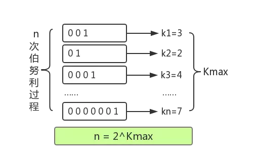
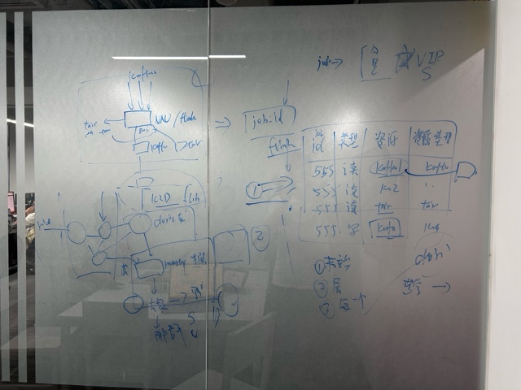
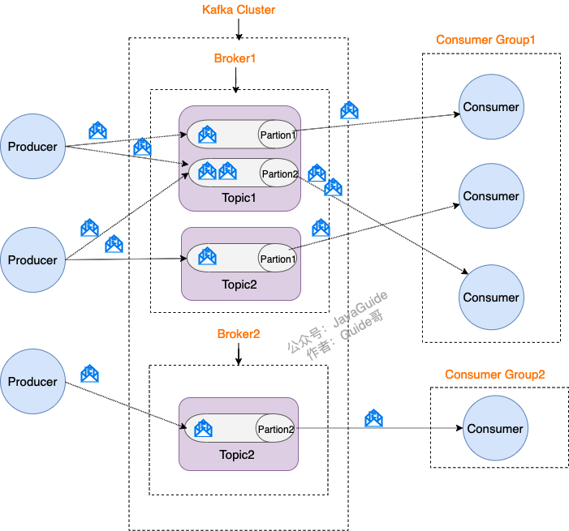
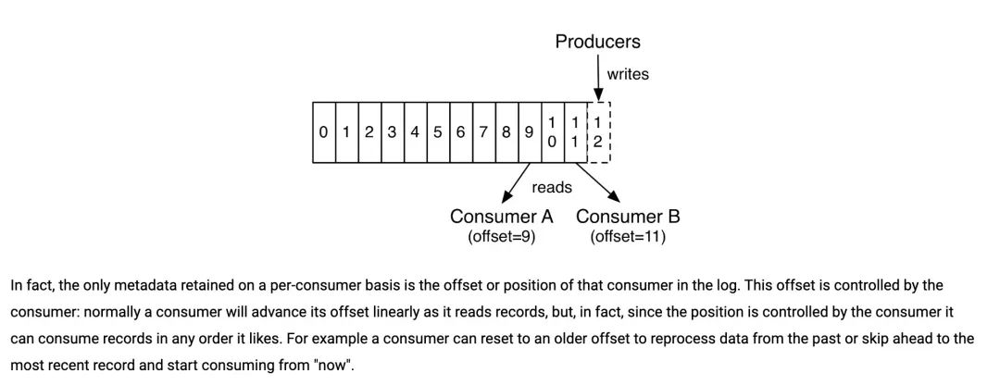

# 《SparkSQL内核剖析》

1. Hadoop 是一个开源的分布式计算框架，它主要用于处理和分析大数据。

2. HDFS全称为Hadoop Distributed File System，是Hadoop生态系统中的一部分。HDFS是一个分布式文件系统，本质上是为了大量的数据能横跨成百上千台机器。

3. MapReduce是一种分布式计算框架，用于处理大规模数据集。MapReduce将大规模数据集分成小块，然后分配给不同的计算节点进行并行处理，最后将结果合并为一个整体的结果。一个MapReduce使用过程：Map和Reduce两个计算过程。

    - **例子**：文本每个词出现的频率：Map阶段，几百台机器同时读取这个文件的各个部分，分别把各自读到的部分分别统计出词频，产生类似(hello, 12100次)，(world，15214次)等等这样的Pair，这几百台机器各自都产生了如上的集合；然后又有几百台机器启动Reduce处理。Reducer机器A将从Mapper机器收到所有以A开头的统计结果，机器B将收到B开头的词汇统计结果(当然实际上不会真的以字母开头做依据，而是用函数产生Hash值以避免数据串化。因为类似X开头的词肯定比其他要少得多，而你不希望数据处理各个机器的工作量相差悬殊)。然后这些Reducer将再次汇总，(hello，12100)+(hello，12311)+(hello，345881)= (hello，370292)。每个Reducer都如上处理，你就得到了整个文件的词频结果。

    - **缺陷**：但它太繁琐了，需要更高层更抽象的语言层来描述算法和数据处理流程。于是就有了Pig和Hive。Pig是接近脚本方式去描述MapReduce，Hive则用的是SQL。它们把脚本和SQL语言翻译成MapReduce程序，丢给计算引擎去计算，而就可以从繁琐的MapReduce程序中解脱出来，用更简单更直观的语言去写程序了。

    - **新引擎出现**：Hive易上手，但发现hive在MapReduce太慢了，于是Hive on Tez / Spark和SparkSQL出现了，他们的理念是MapReduce慢，但是如果我用新一代通用计算引擎Tez或者Spark来跑SQL，那我就能跑的更快。而且用户不需要维护两套系统。这就好比如果你厨房小，人又懒，对吃的精细程度要求有限，那你可以买个电饭煲，能蒸能煲能烧，省了好多厨具。

    - **总结**：上面的介绍，基本就是一个数据仓库的构架了。底层HDFS，上面跑MapReduce/Tez/Spark，在上面跑Hive，Pig。或者HDFS上直接跑Impala，Drill，Presto。这解决了中低速数据处理的要求。

    - **更进一步**：如果需要更快的处理呢？如果我是一个类似微博的公司，我希望显示不是24小时热博，我想看一个不断变化的热播榜，更新延迟在一分钟之内，上面的手段都将无法胜任。于是又一种计算模型被开发出来，这就是Streaming(流)计算。Storm是最流行的流计算平台。流计算的思路是，如果要达到更实时的更新，我何不在数据流进来的时候就处理了?比如还是词频统计的例子，我的数据流是一个一个的词，我就让他们一边流过我就一边开始统计了。流计算很牛逼，基本无延迟，但是它的短处是，不灵活，你想要统计的东西必须预先知道，毕竟数据流过就没了，你没算的东西就无法补算了。因此它是个很好的东西，但是无法替代上面数据仓库和批处理系统。

    - **独立的模块**：KV Store，比如Cassandra，HBase，MongoDB，设计理念：我有一堆键值，我能很快速滴获取与这个Key绑定的数据。KV Store的理念是，基本无法处理复杂的计算，大多没法JOIN，也许没法聚合，没有强一致性保证(不同数据分布在不同机器上，你每次读取也许会读到不同的结果，也无法处理类似银行转账那样的强一致性要求的操作)。但是丫就是快。极快。

4. Hive是基于Hadoop的一个数据仓库工具，可以将结构化的数据文件映射为一张数据库表，并提供简单的sql查询功能，可以将sql语句转换成MapReduce任务进行运行。因此我们可以通过Hive来快速的实现简单的MapReduce统计，不必开发专门的MapReduce应用。Hive的作用其实就是将sql语句解析成M/R Job，然后在hadoop上执行，Hive中的表其实就是Hadoop中的目录或者文件，按照表名将文件夹分开。  
Hive跟用户之间的交互主要通过三种：Shell/CLI、客户端、web接口。  
Shell/CLI：是终端命令行的形式，使用Hive命令跟Hive进行交互，CLI在启动的时候会同时启动一个Hive副本。  
客户端：主要包括JDBC客户端和ODBC客户端，这种是Java的实现方式，与传统的JDBC编程类似。  
WebUI：通过浏览器访问hive，主要用来将我们的sql语句提交给hive  
Thrift：这个是Facebook开发 的一个软件框架，可以用来跨语言的服务开发，支持多用语言调用hive的接口。  
元数据：这里存放了hive中的数据的描述信息，比如标的信息、表的列的信息、属性的信息、所在目录等等  
解析器：主要完成sql语句从词法、语法、编译、优化以及查询的生成  
编译器：主要讲sql语句编译成一个MR的任务。 
优化器：主要是对sql进行优化。  
执行器：提交MR任务，并在hadoop上执行。  

5. RDD编程模型 RDD（Resilient Distributed Datasets，弹性分布式数据集）是Spark中的基本抽象概念，它是一个可并行操作的数据集合。Resilient（有弹性的）

-  RDD是一种抽象的分布式数据结构，指向数据和其处理逻辑的描述性对象，用于表示一个分布在多个计算节点上的只读数据集合。这些数据可以存储在内存中或磁盘上，但RDD本身是对这些数据的逻辑表示。

- 数据分布描述：RDD包含了如何将数据分布在不同计算节点上的信息。它不仅指向数据的位置，还描述了数据是如何分割和分配的。

- 不可变性和转换：RDD是不可变的，所有的操作（如map、filter等）都是在现有的RDD上生成新的RDD。这种不可变性和转换逻辑也是RDD的一部分。

- 血统信息（Lineage）：RDD记录了数据的生成过程和操作链（即血统信息）。这使得RDD在计算过程中具备容错能力，能够通过重新计算来恢复丢失的数据。

- 惰性计算：RDD的转换操作是惰性执行的，只有在需要计算结果时才会执行。这种惰性计算确保了数据在处理过程中的稳定性，因为数据不会在中间步骤被意外修改。类似于写了一个函数，但只有我调用的时候才会去计算。

- 容错性：基于 RDD 之间的依赖， 个任务流可以描述为 DAG 在实际执行的时候，RDD 通过 Lineage 信息（血缘关系）来完成容错，即使出现数据分区丢失，也可以通过 Lineage信息重建分区。如果后期开发中DAG越来越大，Lineage越来越长，在数据恢复时就需要大量时间重建，就可以使用checkpoint机制，将数据持久化，切断之前的Lineage信息，从而不需要知道父RDD,而直接从checkpoint处获取信息。

6. 基于RDD的计算任务可被描述为：从稳定的物理存储（如分布式文件系统 HDFS)中加载记录，记录被传入由组确定性操作构成的 DAG (有向无环图），然后写回稳定存储。

7. DDL（Data Definition Language）：定义和管理数据结构的操作。创建、修改和删除表、视图、索引等。DDL操作通常用于定义数据模型和数据结构，而不涉及实际的数据处理和查询操作。

8. MPP (Massively Parallel Processing)，大规模并行处理系统。

9. Spark SQL 系统，从SQL到Spark的RDD 的执行需要经过两个大的阶段，分别是逻辑计划(LogicalPlan)和物理计划(PhysicalPlan)

10. Spark SQL 内部实现流程中平台无关部分的基础框架称为 Catalyst。InternalRow 体系用于表示行数据，TreeNode 体系用于表示查询计划的逻辑结构，而Expression 体系则用于表示SQL查询中的各种计算和操作。这三个体系共同构成了Spark SQL中的Catalyst查询引擎的核心组成部分

- lnternalRow 体系：InternalRow 就是用来表示一行行数据的类，InternalRow中都是根据下标来访问和操作列元素的。

    - GenericlnternalRow 构造参数是 Array[Any]类型，Any是所有类型的超类。用对象数组进行底层存储， genericGet 也是直接根据下标访问的。类型安全是在运行时而不是编译时提供的（Java和C#就是在编译时进行类型检查的语言，而python是运行时检查）。

    - GenericlnternalRow 的数组是引用传递的，所以不允许通过set改变，而SpecificInternalRow则是以拷贝的数组传为构造参数传递的，所以允许通过set操作修改。

- TreeNode体系：中间数据结构。是SparkSQL中所有树结构的基类。定义了一个系列通用的集合操作和树遍历操作接口。是一种泛型。并提供最简单基础的操作。

- Expression 体系：表达式一般指的是不需要触发执行引擎而能够直接进行计算的单元，例如加减乘除四则运算、逻辑操作、转换操作、过滤操作等。e g：col("name") === "Alice" 或 col("salary") * 1.1,是细粒度。对于算子或查询计划（QueryPlan）指的是对数据集的整体操作，如过滤、连接、聚合等。e g：Filter（过滤算子）、Join（连接算子）、Aggregate（聚合算子），是粗粒度。

    - 有一些CodegenFallback 接口：不支持代码生成的表达式 某些表达式涉及第三方实现（例如 Hive UDF ）等情况，无法生成 Java 代码，此时通过 CodegenFallback 直接调用eval方法执行，该接口中实现了具体的调用方法。它通过提供一种回退机制（Fallback mechanism，有一些UDF可能不能生成较好的字节码去执行，而使用该表达式的eval方法来直接计算结果）来保证这些表达式的兼容性和可执行性。

    - genCode和doGenCode用于生成表达式对应的Java代码。

11. Apache Spark 是一个开源的大数据处理框架，Spark 支持多种编程语言，包括 Scala、Java、Python 和 R，Catalyst 是 Apache Spark SQL 的查询优化框架。它负责分析、优化和编译 SQL 查询，Spark 是用 Scala 编写的，而 Scala 本身运行在 Java 虚拟机（JVM）上。

12.平台无关，逻辑计划（Logical Plan）平台无关,属于TreeNode，仍然是抽象类，继承于父类QueryPlan,父类有6个模块输入输出、字符串、规范化、表达式操作、基本属性和约束。

- 由SparkSqlParser 中的AstBuilder对语法树的各种Context节点访问，并转换为对应的LogicalPlan节点，然后形成未解析的逻辑运算子树：不包含数据信息和列信息。

    - 生成数据表对应的LogicalPlan：访问FromClauseContext并递归访问，一直匹配到TableNameContext节点，根据其数据信息生成UnresolvedRelation，构造名为from的LogicalPlan。

    - 生成加入过滤逻辑的LogicalPlan：对应SQL的where语句，递归访问BooleanDefaultContext节点，并生成expression作为过滤条件，然后基于此表达式生成Filter LogicalPlan节点。

    - 生成加入列裁剪以后的LogicalPlan：对应SQL中的select语句。

- 经过Analyzer（继承于RuleExecutor）一系列规则作用在Unresolved LogicalPlan上，将其节点解析成有类型（Typed）的对象，并对树上的节点绑定各种数据，生成解析后的逻辑算子树（Analyzed LogicalPlan）。

    - Catalog：一个容器或数据库对对象命名空间中的一个层次，主要用来解决命名冲突问题。在SparkSQL的Catalog实现中以SessionCatalog为主体，对底层元数据、临时表、视图、函数信息进行了封装。并且还包括mutable类型的HashMap用来管理临时表，currentDB成员变量用来指当前操作的数据库名称。

    - RULE 体系：在unresolved LogicalPlan 操作（绑定、解析、优化）基于RULE（规则）。RULE是一个抽象类，通过子类实现apply方法来制定特定逻辑。通过RuleExector驱动程序来调用。

    - Analyzer执行时调用父类的run方法，执行一些规则：with 临时逻辑子表的替换、消除冗余的union，group by 常数替换（2.0以后），

- 由SparkSQL的优化器将优化规则作用到上一步结果中，生成优化以后的逻辑算子树（Optimized LogicalPlan）。

    - Optimizer 同样继承于RuleExecutor类，调用父类的execute方法，在QueryExecution中，优化器对解析后的逻辑算子树，执行execute方法。

    - 执行一些规则：表达式替换、计算时间表达式、将**distinct转换为group by**、删除group by多余的常数、算子下推（使得逻辑算子树中上层算子节点尽量靠近叶子结点）、算子组合、常量折叠和长度削减

        ***为什么要转换***？原因：使用distinct会将所有的order_no都shuffle到一个reducer里面，导致数据倾斜，都倾斜到一个reducer，如果使用group by，起了多个reducer，将数据分布到多台机器上执行，时间较快。Hive会根据数据的大小动态的指定Reduce大小。

- 对于用户的 SQL 语句，逻辑算子树既要完全涵盖查询与处理中的语义逻辑，又要定义各种体系的数据结构，并将这些数据结构整合在一起；对于后续的物理算子阶段，逻辑算子树需要提供完整的逻辑信息。

13. 物理计划（Physical Plan），平台有关。

- 由 SparkPlanner 将各种物理计划策略（Strategy）作用于对应的 LogicalPlan 节点上，生SparkPlan 列表（注: LogicalPlan 可能产生多种 SparkPlan)

    - SparkPlan节点记录其元数据（metadata）与指标（metric），以K-V形式保存在Map数据结构中；对RDD进行Transformation操作时，会进行数据分区（Partitioning）和排序（Ordering）的处理；作为物理计划，提交到SparkCore去执行，以execute为主。

        - 元数据Metedata的Map中key和value都是字符串类型，用与表示：数据文件格式、储存路径等

        - 指标Metrics的Map中key为字符串类型，Value为Metric类型

        - 分区（Partitioning）-为什么要分区：【数据分区，在分布式集群里，网络通信的代价很大，减少网络传输可以极大提升性能。MapReduce框架的性能开支主要在io和网络传输，因为要大量读写文件，它是不可避免的，但是网络传输是可以避免的，把大文件压缩变小文件，   从而减少网络传输，但是增加了cpu的计算负载。Spark里面io也是不可避免的，但是网络传输spark里面进行了优化：Spark把RDD进行分区（分片），放在集群上并行计算。同一个RDD分片100个，10个节点，平均一个节点10个分区，当进行sum型的计算的时候，先进行每个分区的sum，然后把sum值shuffle传输到主程序进行全局sum，所以进行sum型计算对网络传输非常小。但对于进行join型的计算的时候，需要把数据本身进行shuffle（即将需要关联的数据放入一个节点进行计算），网络开销很大。spark是如何优化这个问题的呢？Spark把key-value RDD通过key的hashcode进行分区，而且保证相同的key存储在同一个节点上，这样对改RDD进行key聚合时，就不需要shuffle过程.我们进行mapreduce计算的时候为什么要进行shuffle？，就是说mapreduce里面网络传输主要在shuffle阶段，shuffle的根本原因是相同的key存在不同的。节点上，按key进行聚合的时候不得不进行shuffle。shuffle是非常影响网络的，它要把所有的数据混在一起走网络，然后它才能把相同的key走到一起。要进行shuffle是存储决定的。Spark从这个教训中得到启发，Spark利用key的hashcode来对数据进行分区，确保具有相同key的记录会被分配到同一个分区  内。这样，相同的key总是位于同一个节点上，从而优化了基于key的操作，如聚合和连接。它能保证存储的时候相同的key能够存在同一个节点上。尽管Spark尽力保证分区的大小相对均衡，但由于key的分布本身可能是不均匀的，实际上分区之间的大小可能会有所不同。通过智能分区，Spark在执行某些需要大量数据交换的操作（如join、groupByKey等）时减少了shuffle的需要。对于join操作，常见的优化策略包括预先对大表进行分区，而在执行join时只对小表进行shuffle。spark解决网络传输这块的根本原理就是这个。】

        - 分布（distribution）：可以用来描述数据特征，用于让一些agg算子判断是否进行局部计算以节省计算；并且可以描述单个分区内的数据分布，一个比较关键的实现是BroadcastDistribution（广播分布），使得executor中存储较大的只读文件而不是在task运行时每一个task均向网络上节点请求一个该文件，在其上运行多个task直接读取此文件即可，不需要经过网络传输。这极大地减少了网络传输的数据量和降低了延迟。

- 选取最佳的 SparkPlan ，在 Spark2 版本中的实现较为简单，在候选列表中直接用 next()方法获取第一个。

- 提交前进行准备工作，进行一些分区排序方面的处理，确保 SparkPlan 各节点能够正确执行，这步通过 prepareForExecution 方法调用若干规则(Rule)进行转换。e.g.EnsureRequirements规则：保证物理计划能够执行，包括对分区和排序逻辑的处理——添加shuffle或者排序来达到要求。

