<style>
h1 {font-size: 2.5rem;}
h2 {font-size: 2rem;}
h3 {font-size: 1.8rem;}
p {font-size: 1.5rem;}
 ol, li {font-size: 1.5rem;} /* 设置有序列表和列表项的字体大小 */
</style>
# Kafka是什么
Kafka 是一个分布式流式处理平台。
流平台具有三个关键功能：
1. 消息队列：发布和订阅消息流，这个功能类似于消息队列，这也是 Kafka 也被归类为消息队列的原因。一个消息队列需要求：异步处理、流量控制和服务解耦。
2. 容错的持久方式存储记录消息流：Kafka 会把消息持久化到磁盘，有效避免了消息丢失的风险。
3. 流式处理平台： 在消息发布的时候进行处理，Kafka 提供了一个完整的流式处理类库。

# 队列模型
## 队列模型：早期的消息模型

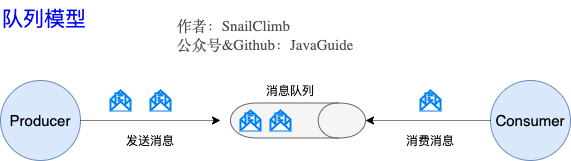
使用队列（Queue）作为消息通信载体一条消息只能被一个消费者使用，未被消费的消息在队列中保留直到被消费或超时。  
队列模型存在的问题：需要将生产者产生的消息分发给多个消费者，并且每个消费者都能接收到完整的消息内容。

## 发布-订阅模型:Kafka 消息模型
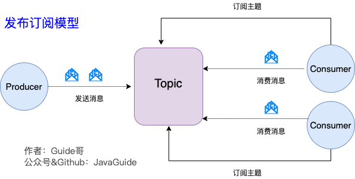


发布订阅模型（Pub-Sub） 使用主题（Topic） 作为消息通信载体，类似于广播模式；发布者发布一条消息，该消息通过主题传递给所有的订阅者，在一条消息广播之后才订阅的用户则是收不到该条消息的。

在发布 - 订阅模型中，如果只有一个订阅者，那它和队列模型就基本是一样的了。所以说，发布 - 订阅模型在功能层面上是可以兼容队列模型的。

# Kafka核心概念
Kafka 将生产者发布的消息发送到 Topic（主题） 中，需要这些消息的消费者可以订阅这些 Topic（主题）
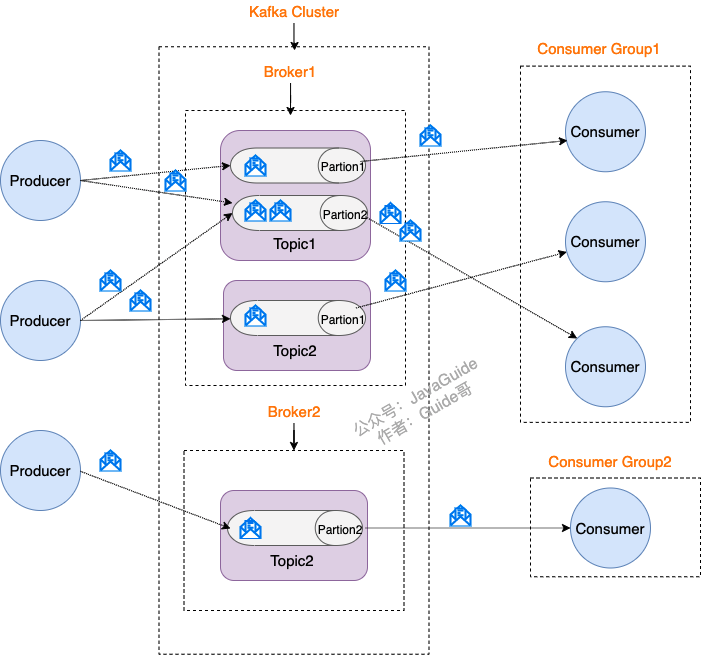
1. Producer（生产者） : 产生消息的一方。
2. Consumer（消费者） : 消费消息的一方。
3. Broker（代理） : 可以看作是一个独立的 Kafka 实例。多个 Kafka Broker 组成一个 Kafka Cluster。

同时，你一定也注意到每个 Broker 中又包含了 Topic 以及 Partition 这两个重要的概念：

- Topic（主题） : Producer 将消息发送到特定的主题，Consumer 通过订阅特定的 Topic(主题) 来消费消息。 

-  Partition（分区） : Partition 属于 Topic 的一部分。一个 Topic 可以有多个 Partition ，并且同一 Topic 下的 Partition 可以分布在不同的 Broker 上，这也就表明一个 Topic 可以横跨多个 Broker 。
- 如何保证消息的顺序：

对于消费者:每个消费组内部维护自己的一组消费位置，每个队列对应一个消费位置。消费位置在服务端保存，并且，消费位置和消费者是没有关系的。每个消费位置一般就是一个整数，记录这个消费组中，这个队列消费到哪个位置了，这个位置之前的消息都成功消费了，之后的消息都没有消费或者正在消费。
对于消息队列：在发送端，使用账户 ID 作为 Key，采用一致性哈希算法计算出队列编号，指定队列来发送消息。一致性哈希算法可以保证，相同 Key 的消息总是发送到同一个队列上，这样可以保证相同 Key 的消息是严格有序的。
## Kafka 的多副本机制
 Kafka 为分区（Partition）引入了多副本（Replica）机制。分区（Partition）中的多个副本之间会有一个叫做 leader 的家伙，其他副本称为 follower。我们发送的消息会被发送到 leader 副本，然后 follower 副本才能从 leader 副本中拉取消息进行同步。

 生产者和消费者只与 leader 副本交互。其他副本只是 leader 副本的拷贝，它们的存在只是为了保证消息存储的安全性。当 leader 副本发生故障时会从 follower 中选举出一个 leader,但是 follower 中如果有和 leader 同步程度达不到要求的参加不了 leader 的竞选。

 ## Kafka 的多分区（Partition）以及多副本（Replica）机制有什么好处
 
 1. Kafka 通过给特定 Topic 指定多个 Partition, 而各个 Partition 可以分布在不同的 Broker 上, 这样便能提供比较好的并发能力（负载均衡）。
2. Partition 可以指定对应的 Replica 数, 这也极大地提高了消息存储的安全性, 提高了容灾能力，不过也相应的增加了所需要的存储空间。

## 重平衡机制

多个消费者实例共同组成的一个 Consumer Group（消费者组）通过 Group ID（字符串） 唯一标识 Consumer

为了保证消息处理的**有序性**和**避免重复消费**：Group.Topic 下的每个 Partition 只从属于 Consumer Group 中的一个 Consumer，不可能出现 Consumer Group 中的两个 Consumer 负责同一个 Partition。

一个消费组中的消费者和订阅的主题分区数量建议相等。
###  假如某个  Consumer Group  突然加入或者退出了一个 Consumer，会发生什么情况呢？
重平衡（Rebalance）。什么时候会重平衡？

● 订阅的 Topic 内的 Partition 发生变更

● 订阅的 Topic 发生变更

## 如何保证Kafka不丢失消息?

丢失消息有 3 种不同的情况，针对每一种情况有不同的解决方案。

###  生产者丢失消息的情况  
生产者(Producer) 调用send方法发送消息之后，消息可能因为网络问题并没有发送过去。所以，我们不能默认在调用 send() 方法发送消息之后消息消息发送成功了。  
我们要判断消息发送的结果。  但是，要注意的是 Producer 使用 send() 方法发送消息实际上是异步的操作，我们可以通过 get()方法获取调用结果，但是这样也让它变为了同步操作，示例代码如下：
```java
SendResult<String, Object> sendResult = kafkaTemplate.send(topic, o).get();
if (sendResult.getRecordMetadata() != null) {
  logger.info("生产者成功发送消息到" + sendResult.getProducerRecord().topic() + "-> " + sendRe
              sult.getProducerRecord().value().toString());
}
```
但是一般不推荐这么做！可以采用为其添加回调函数的形式，示例代码如下：

``` java 

ListenableFuture<SendResult<String, Object>> future = kafkaTemplate.send(topic, o);
future.addCallback(result -> logger.info("生产者成功发送消息到topic:{} partition:{}的消息", result.getRecordMetadata().topic(), result.getRecordMetadata().partition()),ex -> logger.error("生产者发送消失败，原因：{}", ex.getMessage()));
```
如果消息发送失败的话，我们检查失败的原因之后重新发送即可！

另外，这里推荐为 Producer 的 retries（重试次数）设置一个比较合理的值，一般是 3 ，但是为了保证消息不丢失的话一般会设置比较大一点。设置完成之后，当出现网络问题之后能够自动重试消息发送，避免消息丢失。另外，建议还要设置重试间隔，因为间隔太小的话重试的效果就不明显了，网络波动一次你 3 次一下子就重试完了.

### 消费者丢失消息的情况
消息在被追加到 Partition(分区)的时候都会分配一个特定的偏移量（offset）。offset 表示 Consumer 当前消费到的 Partition(分区)的所在的位置。Kafka 通过偏移量（offset）可以保证消息在分区内的顺序性。
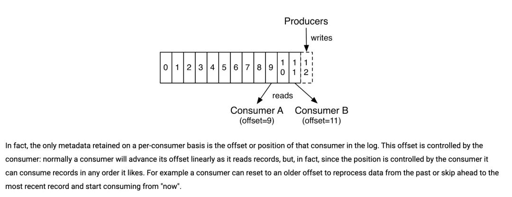


当消费者拉取到了分区的某个消息之后，消费者会自动提交了 offset。自动提交的话会有一个问题，试想一下，当消费者刚拿到这个消息准备进行真正消费的时候，突然挂掉了，消息实际上并没有被消费，但是 offset 却被自动提交了。

对此可以选择：手动关闭自动提交 offset，每次在真正消费完消息之后之后再自己手动提交 offset。手动提交 offset 虽然可以解决这个问题，但也会带来消息重复消费的风险。
更好的解决办法：
- 幂等处理：
在应用层面确保消息处理的幂等性，即使同一条消息被处理多次，结果也是一样的。可以通过使用唯一的消息 ID 或者事务来实现幂等性。

- 事务性消费：
Kafka 0.11.0 及以上版本支持事务性消费，可以在一个事务中读取、处理和提交 offset，这样可以保证消息处理和 offset 提交的原子性，避免重复消费和消息丢失的问题。


### Kafka 弄丢了消息  
Leader 副本所在的 Broker 突然挂掉，那么就要从 Fllower 副本重新选出一个  Leader ，但是  Leader 的数据还有一些没有被 Follower 副本的同步的话，就会造成消息丢失。  

解决办法：
- 设置 acks = all  
acks 的默认值即为1，代表我们的消息被leader副本接收之后就算被成功发送。当我们配置 acks = all 表示只有所有 ISR 列表的副本全部收到消息时，生产者才会接收到来自服务器的响应. 这种模式是最高级别的，也是最安全的，可以确保不止一个 Broker 接收到了消息. 该模式的延迟会很高.

- 设置 replication.factor >= 3  
这样就可以保证每个 Partition 至少有 3 个副本。虽然造成了数据冗余，但是带来了数据的安全性。


- min.insync.replicas > 1  
一般情况下我们还需要设置 min.insync.replicas> 1 ，这样配置代表消息至少要被写入到 2 个副本才算是被成功发送。min.insync.replicas 的默认值为 1 ，在实际生产中应尽量避免默认值 1。但是，为了保证整个 Kafka 服务的高可用性，你需要确保 replication.factor > min.insync.replicas 。为什么呢？设想一下假如两者相等的话，只要是有一个副本挂掉，整个分区就无法正常工作了。这明显违反高可用性！一般推荐设置成 replication.factor = min.insync.replicas + 1。

- 设置 unclean.leader.election.enable = false  
当 Leader 副本发生故障时就不会从 Follower 副本中和 Leader 同步程度达不到要求的副本中选择出 Leader ，这样降低了消息丢失的可能性。


## 如何保证高可用
Kafka 允许同一个 Partition 存在多个消息副本，每个 Partition 的副本通常由 1 个 Leader 及 0 个以上的 Follower 组成，生产者将消息直接发往对应 Partition 的 Leader，Follower 会周期地向 Leader 发送同步请求

同一 Partition 的 Replica 不应存储在同一个 Broker 上，因为一旦该 Broker 宕机，对应 Partition 的所有 Replica 都无法工作，这就达不到高可用的效果

所以 Kafka 会尽量将所有的 Partition 以及各 Partition 的副本均匀地分配到整个集群的各个 Broker 上
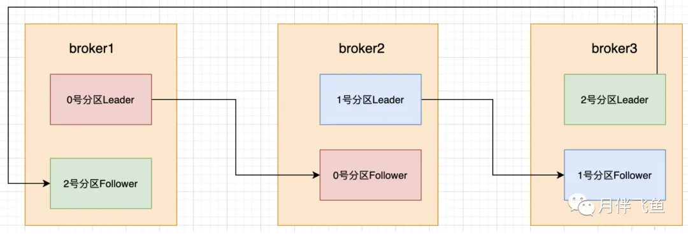
### ISR（In-Sync Replicas，同步副本集）

用于确保数据的高可用性和一致性。

在 Kafka 中，每个分区（Partition）都有一个领导者副本（Leader）和若干个副本（Replicas）。这些副本分为同步副本（In-Sync Replicas, ISR）和非同步副本（Out-of-Sync Replicas）。同步副本是指与领导者副本保持同步的副本，非同步副本是指没有与领导者副本保持同步的副本。

这里的保持同步不是指与 Leader 数据保持完全一致，只需在replica.lag.time.max.ms时间内（默认为500ms）与 Leader 保持有效连接。

ISR 机制的工作原理
- 消息写入：当生产者向 Kafka 发送消息时，消息首先写入到分区的领导者副本。领导者副本将消息复制到 ISR 集合中的所有副本。
- 副本同步：ISR 集合中的副本会定期从领导者副本拉取消息进行同步。如果某个副本在一定时间内未能从领导者副本拉取到最新的消息，则该副本会被移出 ISR 集合，进入 OSR 集合。
- 副本失效处理：如果领导者副本失效，Kafka 会从 ISR 集合中选举一个新的领导者副本。由于 ISR 集合中的副本都是同步的，新选举的领导者副本可以保证数据的一致性和高可用性。
- 副本恢复：如果某个 OSR 副本恢复并且与领导者副本重新同步，它将重新加入 ISR 集合。


### Unclean 领导者选举

当 Kafka 中unclean.leader.election.enable配置为 true(默认值为 false)且 ISR 中所有副本均宕机的情况下，才允许 ISR 外的副本被选为 Leader，此时会丢失部分已应答的数据。

开启 Unclean 领导者选举可能会造成数据丢失，但好处是，它使得分区 Leader 副本一直存在，不至于停止对外提供服务，因此提升了高可用性，反之，禁止 Unclean 领导者选举的好处在于维护了数据的一致性，避免了消息丢失，但牺牲了高可用性


### ACK 机制
- acks=0

生产者无需等待服务端的任何确认，消息被添加到生产者套接字缓冲区后就视为已发送，因此 acks=0 不能保证服务端已收到消息

- acks=1

只要 Partition Leader 接收到消息而且写入本地磁盘了，就认为成功了，不管它其他的 Follower 有没有同步过去这条消息了

- acks=all

Leader 将等待 ISR 中的所有副本确认后再做出应答，因此只要 ISR 中任何一个副本还存活着，这条应答过的消息就不会丢失。acks=all 是可用性最高的选择，但等待 Follower 应答引入了额外的响应时间。Leader 需要等待 ISR 中所有副本做出应答，此时响应时间取决于 ISR 中最慢的那台机器。

**发送的 acks=1 和 0 消息会出现丢失情况，为不丢失消息可配置生产者acks=all & min.insync.replicas >= 2**


### 故障恢复机制
- Broker

首先需要在集群所有 Broker 中选出一个 Controller，负责各 Partition 的 Leader 选举以及 Replica 的重新分配
.当出现 Leader 故障后，Controller 会将 Leader/Follower 的变动通知到需为此作出响应的 Broker。

Kafka 使用 ZooKeeper 存储 Broker、Topic 等状态数据，Kafka 集群中的 Controller 和 Broker 会在 ZooKeeper 指定节点上注册 Watcher(事件监听器)，以便在特定事件触发时，由 ZooKeeper 将事件通知到对应 Broker

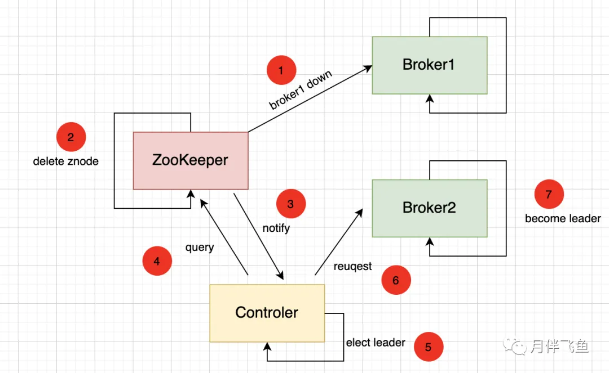

- Controller

集群中的 Controller 也会出现故障，因此 Kafka 让所有 Broker 都在 ZooKeeper 的 Controller 节点上注册一个 Watcher
Controller 发生故障时对应的 Controller 临时节点会自动删除，此时注册在其上的 Watcher 会被触发，所有活着的 Broker 都会去竞选成为新的 Controller(即创建新的 Controller 节点，由 ZooKeeper 保证只会有一个创建成功)
竞选成功者即为新的 Controller。

## kafka为什么这么快？
高度抽象：网络、磁盘、复杂度问题。  
高度抽象的解决方案： 并发、压缩、批量、缓存、算法。  
角色：Producer 、Broker、Consumer这个。
### 随机写——为什么写磁盘慢？
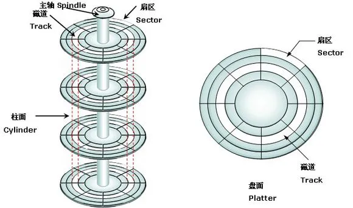

完成一次磁盘 IO，需要经过**寻道、旋转和数据传输**三个步骤。
如果写磁盘时，省略寻道、旋转可以极大提高性能。

- Kafka 采用**顺序写**文件的方式来提高磁盘写入性能。  

Kafka 中每个分区是一个有序的，不可变的消息序列，新的消息不断追加到 Partition 的末尾，在 Kafka 中 Partition 只是一个逻辑概念，Kafka 将 Partition 划分为多个 Segment，每个 Segment 对应一个物理文件，Kafka 对 segment 文件追加写，这就是顺序写文件。

- 为什么 Kafka 可以使用追加写?

说白了，Kafka 就是一个Queue，Queue 是 FIFO 的，数据是有序的。

### 零拷贝Zero-copy

- 传统网络I/O模型：Kafka Consumer 消费存储在 Broker 磁盘的数据，从读取 Broker 磁盘到网络传输给 Consumer   
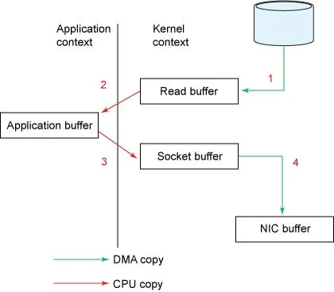. 
1. 第一次：读取磁盘文件到操作系统内核缓冲区；
2. 第二次：将内核缓冲区的数据，copy 到应用程序的 buffer；
3. 第三步：将应用程序 buffer 中的数据，copy 到 socket 网络发送缓冲区；
4. 第四次：将 socket buffer 的数据，copy 到网卡，由网卡进行网络传输。

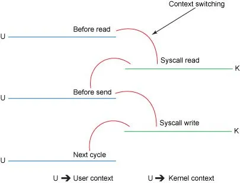

此时存在四个副本，其中两个副本涉及cpu，其中还有四次上下文切换。

**第二步**：用户态到内核态，内核态回到用户态（2次上下文切换）
**第三步**：用户态到内核态，内核态回到用户态（2次上下文切换）

Kafka 使用到了 mmap 和 sendfile 的方式来实现零拷贝。分别对应 Java 的 MappedByteBuffer 和 FileChannel.transferTo。 

使用java实现零拷贝：  
``` java
FileChannel.transferTo();  
```

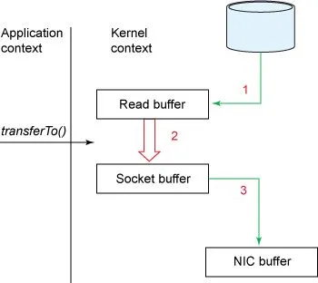

上下文切换的数量减少到一个。具体而言，transferTo()方法指示块设备通过 DMA 引擎将数据读取到读取缓冲区中。然后，将该缓冲区复制到另一个内核缓冲区以暂存到套接字。最后，套接字缓冲区通过 DMA 复制到 NIC 缓冲区。

将副本数从四减少到三，并且这些副本中只有一个涉及 CPU。我们还将上下文切换的数量从四个减少到了两个。

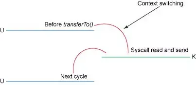

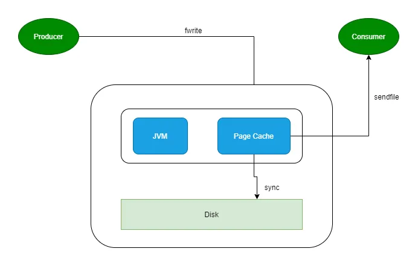

producer 生产消息到 Broker 时，Broker 会使用 pwrite() 系统调用【对应到 Java NIO 的 FileChannel.write() API】按偏移量写入数据，此时数据都会先写入page cache。consumer 消费消息时，Broker 使用 sendfile() 系统调用【对应 FileChannel.transferTo() API】，零拷贝地将数据从 page cache 传输到 broker 的 Socket buffer，再通过网络传输。

leader 与 follower 之间的同步，与上面 consumer 消费数据的过程是同理的。

page cache中的数据会随着内核中 flusher 线程的调度以及对 sync()/fsync() 的调用写回到磁盘，就算进程崩溃，也不用担心数据丢失。另外，如果 consumer 要消费的消息不在page cache里，才会去磁盘读取，并且会顺便预读出一些相邻的块放入 page cache，以方便下一次读取。

因此如果 Kafka producer 的生产速率与 consumer 的消费速率相差不大，那么就能几乎只靠对 broker page cache 的读写完成整个生产 - 消费过程，磁盘访问非常少。

### 网络模型
Kafka 自己实现了网络模型做 RPC。底层基于 Java NIO，采用和 Netty 一样的 Reactor 线程模型。
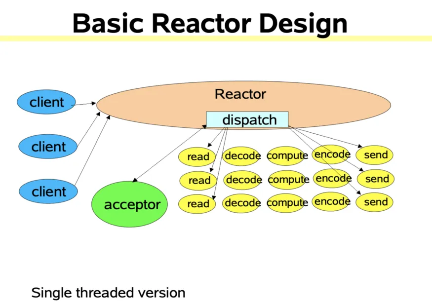

Kafka 即基于 Reactor 模型实现了多路复用和处理线程池。  
其中包含了一个Acceptor线程，用于处理新的连接，Acceptor 有 N 个 Processor 线程 select 和 read socket 请求，N 个 Handler 线程处理请求并响应，即处理业务逻辑。使得系统在单线程的情况下可以同时处理多个客户端请求。它的最大优势是系统开销小，并且不需要创建新的进程或者线程，降低了系统的资源开销。

### 批量传输与压缩消息

Producer 向 Broker 发送消息不是一条消息一条消息的发送。Producer 有两个重要的参数：batch.size和linger.ms。  

高并发读和高吞吐写场景下：  

批量传输与压缩消息。批量主要是为了让传输消息的次数变得更少；  

压缩主要是为了降低网络传输的消耗，提高吞吐量。

Producer 发送消息块，先对其进行压缩，Broker 接收到压缩后的消息块之后，会依次将压缩后的消息块写入文件中（注意：这个时候消息块还是压缩的状态），当消息块到达 Consumer  后，Consumer 才会对消息块进行解压缩

### 是不是分区数越多越好呢？
- 越多的分区需要打开更多的文件句柄
- 客户端 / 服务器端需要使用的内存就越多
- 降低高可用性：分区越多，每个 Broker 上分配的分区也就越多，当一个发生 Broker 宕机，那么恢复时间将很长。

### 文件结构

Kafka 消息是以 Topic 为单位进行归类，各个 Topic 之间是彼此独立的，互不影响。每个 Topic 又可以分为一个或多个分区。每个分区各自存在一个记录消息数据的日志文件。

Kafka 每个分区日志在物理上实际按大小被分成多个 Segment。

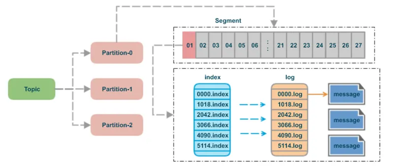

index 采用稀疏索引，这样每个 index 文件大小有限，Kafka 采用mmap的方式，直接将 index 文件映射到内存，这样对 index 的操作就不需要操作磁盘 IO。mmap的 Java 实现对应 MappedByteBuffer 。

Kafka 充分利用二分法来查找对应 offset 的消息位置：

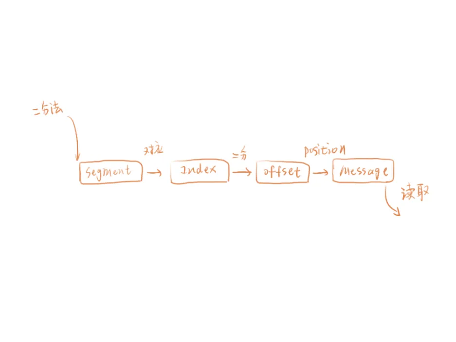

## 原理篇

-  Producer ： 生产者，发送消息的一方。生产者负责创建消息，然后将其发送到 Kafka。  

-  Consumer ： 消费者，接受消息的一方。消费者连接到 Kafka 上并接收消息，进而进行相应的业务逻辑处理。

-  Consumer Group ： 一个消费者组可以包含一个或多个消费者。使用多分区 + 多消费者方式可以极大提高数据下游的处理速度，同一消费组中的消费者不会重复消费消息，同样的，不同消费组中的消费者消费消息时互不影响。Kafka 就是通过消费组的方式来实现消息 P2P 模式和广播模式。

- Broker ： 服务代理节点。Broker 是 Kafka 的服务节点，即 Kafka 的服务器。

- Topic ： Kafka 中的消息以 Topic 为单位进行划分，生产者将消息发送到特定的 Topic，而消费者负责订阅 Topic 的消息并进行消费。

- Partition ： Topic 是一个逻辑的概念，它可以细分为多个 Partition（分区），每个分区只属于单个主题。同一个主题下不同分区包含的消息是不同的，分区在存储层面可以看作一个可追加的日志（Log）文件，消息在被追加到分区日志文件的时候都会分配一个特定的偏移量（offset）。

-  Offset ： offset 是消息在分区中的唯一标识，Kafka 通过它来保证消息在分区内的顺序性，不过 offset 并不跨越分区，也就是说，Kafka 保证的是分区有序性而不是主题有序性。

-  Replication ： 副本，是 Kafka 保证数据高可用的方式，Kafka 同一 Partition 的数据可以在多 Broker 上存在多个副本，通常只有主副本对外提供读写服务，当主副本所在 broker 崩溃或发生网络异常，Kafka 会在 Controller 的管理下会重新选择新的 Leader 副本对外提供读写服务。

-  Record ： 实际写入 Kafka 中并可以被读取的消息记录。每个 record 包含了 key、value 和 timestamp。
### 整体架构
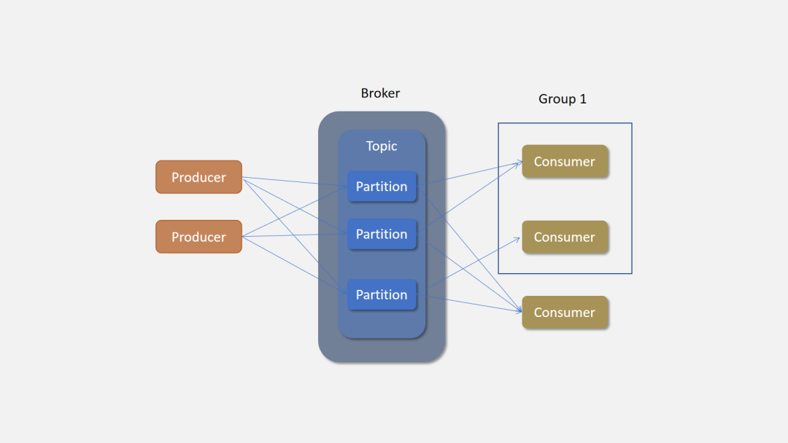

### Network

Kafka 的网络通信模型是基于 NIO 的 Reactor 多线程模型来设计的。其中包含了一个Acceptor线程，用于处理新的连接，Acceptor 有 N 个 Processor 线程 select 和 read socket 请求，N 个 Handler 线程处理请求并响应，即处理业务逻辑。下面就是 KafkaServer 的模型图：

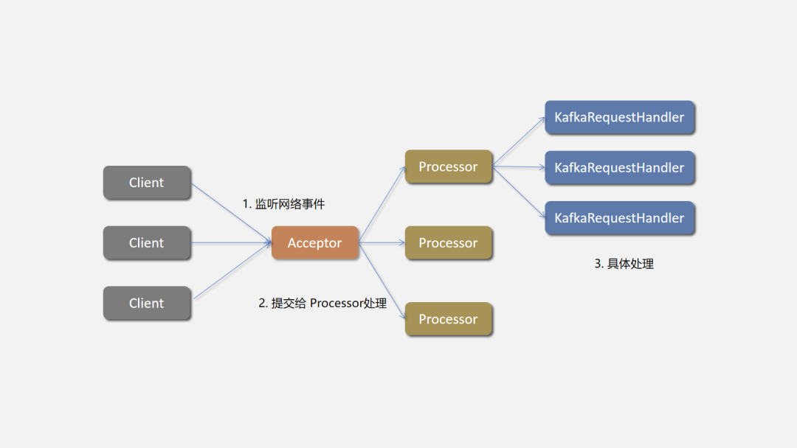


### 一些概念

消费指针（Offset）：
每个消费者在消费消息时只移动消费指针（Offset），记录当前消费到的消息位置。
消费者组中的每个消费者会独立维护自己的消费指针。指针存储在存储在服务器端。

消息保留（Retention）：
消息的删除由Kafka主题的保留策略（如保留时间retention.ms和存储大小retention.bytes）决定，而不是由消费者的消费行为决定。
Kafka会定期根据保留策略清理过期或超出存储限制的消息。

消费不会删除消息：
消费者读取消息时，只是移动消费指针，并不会删除Kafka中的实际消息。
消息在达到保留策略规定的条件之前会一直保留在分区中。

重复消费和幂等性：
消费者可以重复读取同一消息，尤其是在故障重启或重新平衡后。
应用程序通常需要设计成幂等的，以处理重复消费不会引起副作用。


