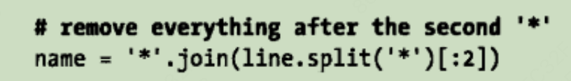
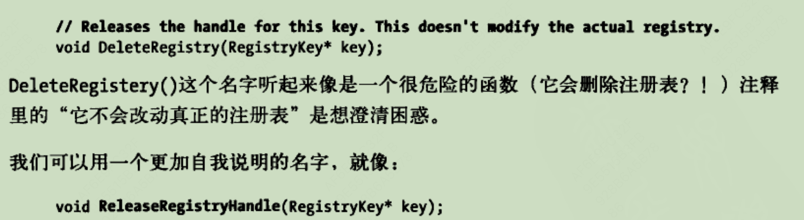

=======
## 一些准则/建议：

- 使用更专业的单词：不用get，而使用fetch（表示从网络中获取资源）或者download（表示从网络下载资源）

- 使用更具体的名字表示变量名：例如在为毫秒的变量名后面加后缀_ms，在未处理的变量面前加前缀raw_

- 有目的的区分大小写、下划线：例如类成员变量的最后加上_来区分它和局部变量

- 在起一个名字以前，想象一下这个名字可能会被误解为什么意思，最好的名字不应该被误解

- 用户期望get/size方法是轻量级（复杂度较低）的方法。

- 使得代码的字段对齐，更容易找出错误拼写与让别人阅读，选择一个有意义的顺序（一般为重要性降序/与调用的顺序一致），并且在后续代码中也使用同一顺序。

- 将代码按功能分块（空行分割），提高可读性，并且提供了脚印👣，可以快速定位上次读到了哪里，注释依旧很重要！

## 注释不是必须的

- （不写注释）不要为那些可以快速推断出意义的代码写注释

- （不写注释）与其给不好理解的函数名加注释比如把函数名改成易懂的名字，好代码>坏代码+好注释

- （写注释）记录作者的思想--导演评论，去记录你在开发中是如何思考的以防止别人以为这边有一个bug，并尝试修复它。

- （写注释）给常量加注释，告诉读者这个常量的意义和取值的原因。

- （写注释）记录代码的瑕疵，eg：//todo：采用更快的算法。

## 以读者的角度写注释：

- （写注释）写出言简意骇的注释-不要使用不明确的代词：

- （写注释）声明代码的意图而不是描述代码

不如

- 编写简洁代码：Dont repeate yourself 不要重复写同一个常量，要把他作为变量存起来再使用。

**如果你不能把一件事解释给你祖母听的话说明你还是没有真正理解它。 ——《编写可读代码的艺术》**

- 解释代码/调试代码——用自然语言说事情

- 别费神实现那个功能，你不会需要他，项目都是从一个垃圾开始的。

- 删除没用的代码——减少它的重量

## 一些单词：

plaintext : 明文 plain：清楚的，浅显的

escape charater： 转义字符

unescape comment :需要转义的评论

cart：大车

shopping cart ：购物车

crawl：爬

## 命名方式：

类名：CamelCase

变量：

类成员变量：以下划线作为结尾，eg：offset_

局部变量/普通变量：lower_separated

不要使用二义性单词命名：

filter("year<=2001"):表示的是过滤掉年份小于等于2001年的数据？还是剩下年份小于等于2001的数据

clip(str,length):应该表示截取字符串前length的字串并返回，但不如使用truncate(text,length)

## 不会误解的名字：

- 使用min和max表示（包含）极限，闭区间

- 使用first和last表示包含的范围，即左闭右闭

- 使用begin和end表示包含/排除的范围，即左闭右开，

Q:**为什么需要这个左闭右开规定，使用左闭右闭不是更符合我们日常生活吗？** 

A:**在一些场景中，使用排除（左闭右开）更方便，例如需要找出所有大于等于1且小于2的数字，如果使用左闭右闭则需要写[1,1.999999....],而右开[1,2)即可**

给bool变量命名时，给变量前面加入明确的前缀例如**is, has,can，eg：isValidPassWord**,这样可以在后续引用时候快速判断数据类型，且避免使用**反义名字**，不使用disable_ssl=false,而使用 use_ssl=true，因为更易读

>>>>>>> 277bd7865d8e7c4abc034f27af3945c27a19b68b