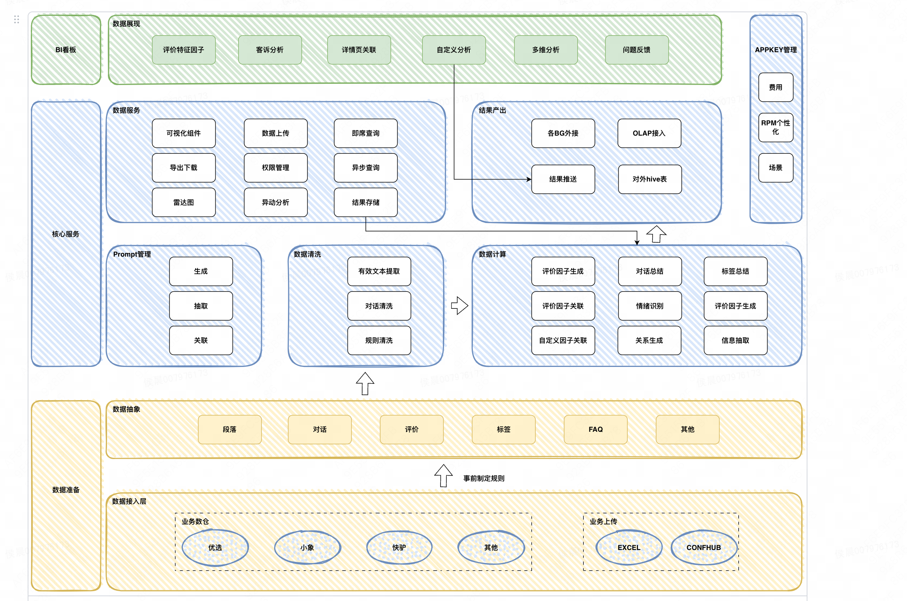

项目背景：
当前，商品评论的分类结果存在不准确且过于宽泛的问题，无法通过评论标签快速理解商品反馈信息。随着大语言模型的兴起，利用近乎全能的大语言模型进行自动、准确、快速且具体的评论分类，成为了一种可行的方法。

对业务的影响：
通过引入大语言模型，可以使业务方更好地掌握行业商品的好评率及评价分类（关键词），并根据竞争对手商品的评价信息、售价、销量和好评率等数据，及时调整我方商品的销售策略。这将有助于提升市场竞争力和决策的科学性。

对用户的影响：
目前，产品评价的分类过于宽泛，无法具体细致地反映商品本身或用户体验，并且充斥着大量无效评论。这使得意向购买用户难以快速、准确地理解商品的使用体验信息。通过改进评论分类，用户能够更直观地获取有价值的反馈信息，从而做出更明智的购买决策。

目标：
- 评价因子准确率由85提升到90
- 在已有计算资源下，提升因子关联速度100%
- 产品召回率提高到92%

架构：

具体措施：
- 筛除无效评论：
    - 字数较少的评论（eg. 好）
    - 不能反映商品本身或者用户体验的评论（eg. 跟着我复制50个字拿积分，只有emoj的评论）

- 批量因子匹配：从单条评论作为单条请求变为多条评论作为单条请求，即小批量配对因子。既使得效率提升，又充分利用大模型的上下文记忆关系保证了配对正确率。
- double check:对于进行了因子配对的商品评论，让大模型进行check结果，对于他认为不正确的结果进行修正，最后发现可以将错误结果变为正确的但几乎不存在将正确结果修改错误的。可以将准确率从85提高到90左右。

todo：
明确需求：
遇到的问题
之后可能遇到的挑战

