<style>
h1 {font-size: 2.5rem;}
h2 {font-size: 2rem;}
h3 {font-size: 1.8rem;}
p {font-size: 1.5rem;}
 ol, li {font-size: 1.5rem;} /* 设置有序列表和列表项的字体大小 */
</style>
# 1. 为什么要消息队列？
## 异步处理
一个经典却没有标准答案的问题：如何设计一个秒杀系统？

核心问题是：如何利用有限的服务器资源，尽可能多地处理短时间内的海量请求。

一个秒杀系统，有很多步骤：
- 风险控制
- 库存锁定
- 生成订单
- 短信通知
- 更新统计数据
只要用户秒杀请求通过风险控制、库存锁定就认为秒杀成功了。
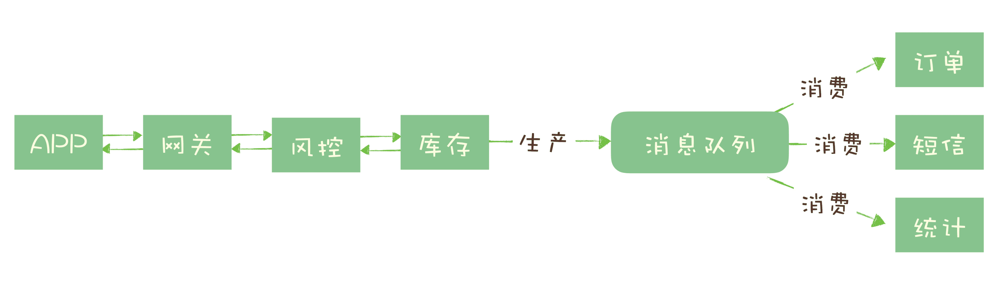

处理一个秒杀请求，从 5 个步骤减少为 2 个步骤，这样不仅响应速度更快，并且在秒杀期间，我们可以把大量的服务器资源用来处理秒杀请求。秒杀结束后再把资源用于处理后面的步骤（异步），充分利用有限的服务器资源处理更多的秒杀请求。

## 流量控制
面临一个问题：如何避免过多的请求压垮我们的秒杀系统？

设计思路是：使用消息队列隔离网关和后端服务，以达到流量控制和保护后端服务的目的。

加入消息队列后，整个秒杀流程变为：
网关在收到请求后，将请求放入请求消息队列
；
后端服务从请求消息队列中获取 APP 请求，完成后续秒杀处理过程，然后返回结果。

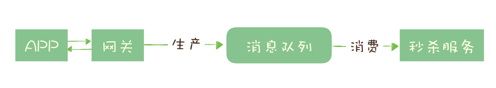

避免短时间大量秒杀请求到达后端，而是先存放到消息队列，然后后端再以自己的最大处理能力，消费消息队列的请求。

对于超时的请求可以直接丢弃，APP 将超时无响应的请求处理为秒杀失败即可。

但这样做同样是有代价的：
- 增加了系统调用链环节，导致总体的响应时延变长。
- 上下游系统都要将同步调用改为异步消息，增加了系统的复杂度。


一个更简单的方法：
如果我们可以估计出秒杀服务的处理能力，就可以同消息队列实现一个令牌桶，实现更简单的流量控制。
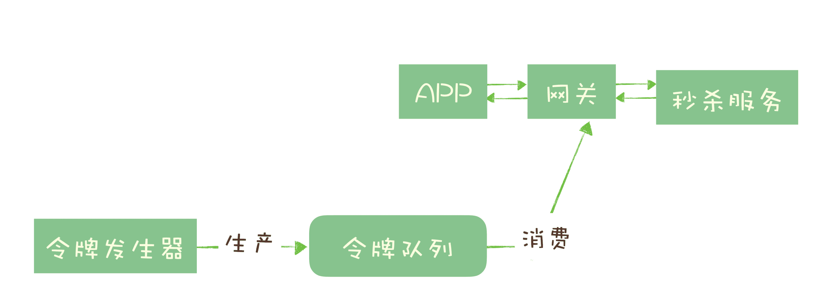
如果令牌队列满了就丢弃令牌，如果网关获取（消费）令牌成功就向调用秒杀服务，否则就返回秒杀失败。

## 服务解耦

电商系统中比较核心的数据，当一个新订单创建时：

支付系统需要发起支付流程；

风控系统需要审核订单的合法性；

客服系统需要给用户发短信告知用户；

经营分析系统需要更新统计数据；

这些订单下游的系统都需要实时获得订单数据。随着业务不断发展，这些订单下游系统不断的增加，不断变化，并且每个系统可能只需要订单数据的一个子集，负责订单服务的开发团队不得不花费很大的精力，应对不断增加变化的下游系统，不停地修改调试订单系统与这些下游系统的接口。任何一个下游系统接口变更，都需要订单模块重新进行一次上线，对于一个电商的核心服务来说，这几乎是不可接受的。

所有的电商都选择用消息队列来解决类似的系统耦合过于紧密的问题。引入消息队列后，订单服务在订单变化时发送一条消息到消息队列的一个主题 Order 中，所有下游系统都订阅主题，这样每个下游系统都可以获得一份实时完整的订单数据。

## 缺陷
- 带来的延迟问题
- 增加了系统复杂性
- 可能产生数据不一致问题


# 2. 可供选择的消息队列
1. RabbtiMQ:  
小众，Erlang语言编写。开箱即用的消息队列，支持非常灵活的路由配置，和其他消息队列不同的是，它在生产者（Producer）和队列（Queue）之间增加了一个 Exchange 模块，理解为交换机。  
但RabbitMQ 对消息堆积的支持并不好；RabbitMQ 的性能最差，每秒钟可以处理几万到十几万条消息；
RabbitMQ 做一些扩展和二次开发比较困难。
 
2. RocketMQ：    
对在线业务的响应时延做了很多的优化，大多数情况下可以做到毫秒级的响应，如果你的应用场景很在意响应时延，那应该选择使用 RocketMQ。  
作为国产的消息队列，相比国外的比较流行的同类产品，在国际上还没有那么流行，与周边生态系统的集成和兼容程度要略逊一筹。

3. Kafka:  
Kafka 与周边生态系统的兼容性是最好的没有之一，尤其在大数据和流计算领域,Kafka 使用 Scala 和 Java 语言开发，设计上大量使用了**批量和异步**的思想，这种设计使得 Kafka 能做到超高的性能。Kafka 的性能，尤其是异步收发的性能，是三者中最好的，与 RocketMQ 并没有量级上的差异，大约每秒钟可以处理几十万条消息.  
异步批量的设计带来的问题是，它的同步收发消息的响应时延比较高，因为当客户端发送一条消息的时候，Kafka 并不会立即发送出去，而是要等一会儿攒一批再发送，在它的 Broker 中，很多地方都会使用这种“先攒一波再一起处理”的设计。当你的业务场景中，每秒钟消息数量没有那么多的时候，Kafka 的时延反而会比较高。所以，Kafka 不太适合**在线业务**场景。


RabbitMQ 采用的是队列模型，但是它一样可以实现发布 - 订阅的功能.
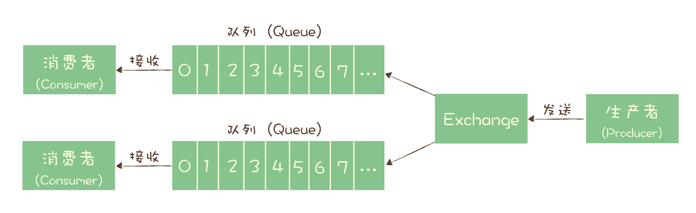
RocketMQ 和 Kafka 采用的是发布 - 订阅模型，并且二者的消息模型是基本一致的。
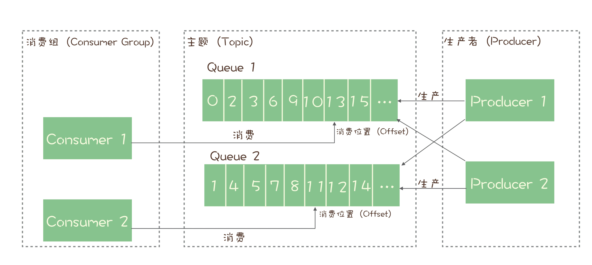

# 3. 消息队列如何实现分布式事务

Kafka和RocketMQ都提供了事务相关功能

一个需求：
在订单库中插入一条订单数据，创建订单；
发消息给消息队列，消息的内容就是刚刚创建的订单。
购物车系统订阅相应的主题，接收订单创建的消息，然后清理购物车，在购物车中删除订单中的商品。

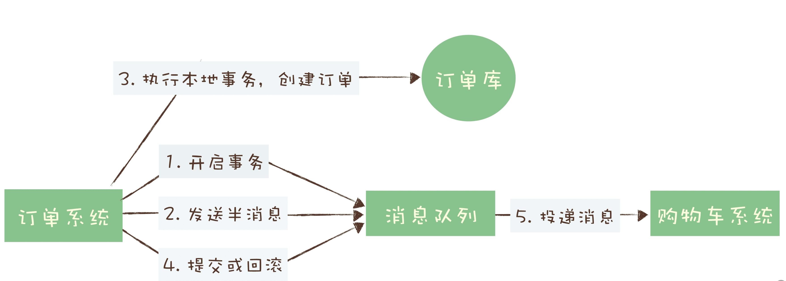

半消息和普通消息的唯一区别是，在事务提交之前，对于消费者来说，这个消息是不可见的。

如果在第四步失败了：  
Kafka：抛出异常  
RocketMQ：事务反查机制————如果 Producer （订单系统），在提交或者回滚事务消息时发生网络异常，RocketMQ 的 Broker 没有收到提交或者回滚的请求，Broker 会定期去 Producer 上反查这个事务对应的本地事务的状态，然后根据反查结果决定提交或者回滚这个事务。
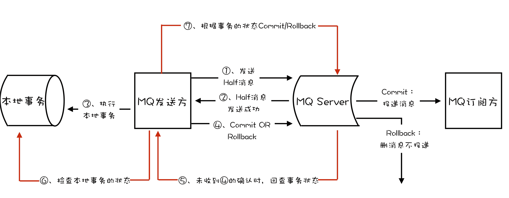

# 4. 如何保证消息不丢失

## 检测丢失方法
利用有序性解决：给Producer端，每次发送消息附加一个连续递增的序号，然后于Consumer端检查序号的连续性（对于Kafka和RocketMQ只保证分区上的消息是有序的）。

## 保证消息可靠传递
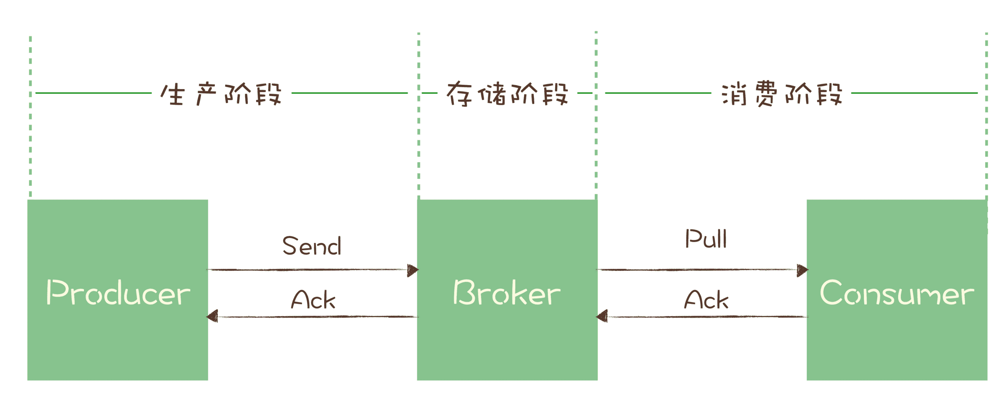 

- 生产阶段：只要 Producer 收到了 Broker 的确认响应，就可以保证消息在生产阶段不会丢失。超时就重发，需注意重发间隔。

- 储存阶段：如果 Broker 出现了故障，比如进程死掉了或者服务器宕机了，可能会丢失消息。  
    1. 对于单个节点的 Broker，需要配置 Broker 参数，在收到消息后，将消息写入磁盘后再给 Producer 返回确认响应，这样即使发生宕机，由于消息已经被写入磁盘，就不会丢失消息，恢复后还可以继续消费。

    2. Broker 是由多个节点组成的集群，需要将 Broker 集群配置成：至少将消息发送到 2 个以上的节点，再给客户端回复发送确认响应。通过要求至少2个副本确认，可以容忍一个副本的故障。

- 消费阶段：采用和生产阶段类似的确认机制来保证消息的可靠性。
客户端从 Broker 拉取消息后，执行用户的消费业务逻辑，成功后，才会给 Broker 发送消费确认响应。如果 Broker 没有收到消费确认响应，下次拉消息的时候还会返回同一条消息，确保消息不会在网络传输过程中丢失，也不会因为客户端在执行消费逻辑中出错导致丢失。  
不要在收到消息后就立即发送消费确认，而是应该在**执行完所有消费业务逻辑**之后，再发送消费确认。

# 5. 如何处理重复消息？

如果producer在发送消息时，由消息队列接收后，返回的ack丢失了，超时重发，导致消息队列收到了重复的消息。

MQTT协议中，三种服务质量：  

- At most once: 至多一次。消息在传递时，最多会被送达一次。换一个说法就是，没什么消息可靠性保证，允许丢消息。一般都是一些对消息可靠性要求不太高的监控场景使用，比如每分钟上报一次机房温度数据，可以接受数据少量丢失。

- At least once: 至少一次。消息在传递时，至少会被送达一次。也就是说，不允许丢消息，但是允许有少量重复消息出现。（绝大多数采用）

- Exactly once：恰好一次。消息在传递时，只会被送达一次，不允许丢失也不允许重复，这个是最高的等级。”

## 使用幂等性解决重复消息
数学语言：如果一个函数 f(x) 满足：f(f(x)) = f(x)，则函数 f(x) 满足幂等性。  
翻译为白话：即其任意多次执行所产生的影响均与一次执行的影响相同。

对于系统：At least once + 幂等消费 = Exactly once。 

1. 利用数据库唯一约束实现幂等性。  
eg.将账户 X 的余额加 100 元。  
建一张转账流水表，这个表有三个字段：转账单 ID、账户 ID 和变更金额，然后给转账单 ID 和账户 ID 这两个字段联合起来创建一个唯一约束，这样对于相同的转账单 ID 和账户 ID，表里至多只能存在一条记录。  
数据库中：INSERT IF NOT EXIST”语义的存储类系统都可以用于实现幂等；可以用 Redis 的 SETNX 命令来替代数据库中的唯一约束。

2. 为更新的数据加入前置条件（乐观锁）
给数据加版本号，如果当前版本号不是消息中版本号那么就拒绝更新数据，否则就更新，然后版本号加1.

3. 记录并检查操作 （Token 机制或者 GUID（全局唯一 ID）机制） 
在执行数据更新操作之前，先检查一下是否执行过这个更新操作：在发送消息时，给每条消息指定一个全局唯一的 ID，消费时，先根据这个 ID 检查这条消息是否有被消费过，如果没有消费过，才更新数据，然后将消费状态置为已消费。


# 6. 消息积压
- 避免消息积压根本：一定要保证消费端的消费性能要高于生产端的发送性能。  

- 预防消息积压：水平扩容，增加消费端的并发数来提升总体的消费性能。    
在扩容 Consumer 的实例数量的同时，必须同步扩容主题中的分区（也叫队列）数量，确保 Consumer 的实例数和分区数量是相等的。
- 消息积压了如何处理：将系统降级，最低限度让系统还能正常运转。  
通过监控查看是消费端还是发送方问题，如果两端的速度变化不大，需要检查消费端，可能消费失败导致的一条消息反复消费。


# 7. 如何实现单个队列的并行消费
如果不要求严格顺序，如何实现单个队列的并行消费？

多个消费者共享指针，也就是一个消费组里多个消费者消费同一个分区。


在 JMQ（京东自研的消息队列产品）中：

- 消息分发：
假设队列中有10条消息，编号为0-9，当前消费位置是5。
当有多个消费者请求拉取消息时，可以将编号为5、6、7的消息分别分配给三个消费者进行并行处理。

- 更新消费位置：
如果编号为5、6、7的消息都成功消费，消费位置可以更新为8。
如果部分消息（例如编号为5的消息）消费失败或响应超时，则可能出现“消息空洞”，导致消费位置无法更新。

- 处理消息空洞：
为了避免消息空洞导致队列被卡住，可以将未成功消费的消息（如编号为5的消息）复制到一个特殊的重试队列中。
将消费位置更新为下一条已成功消费的消息位置（例如更新为8），继续处理后续消息。
优先从重试队列中消费未成功处理的消息，以确保消息最终被处理。

- 并行消费的权衡：
并行消费虽然可以提高处理效率，但也会带来额外的管理和协调开销。
如果消费速度较慢，需要通过增加队列数量或扩容来提升系统的处理能力。

# 8. 实现高性能的异步网络传输 


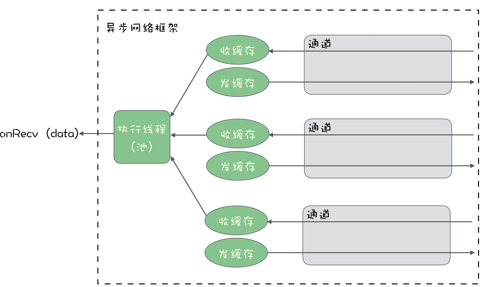

使用 Netty 实现异步接收数据。

```java 
// 创建一组线性
EventLoopGroup group = new NioEventLoopGroup(); 
try{    
    // 初始化
    Server    ServerBootstrap serverBootstrap = new ServerBootstrap();    
    serverBootstrap.group(group);    
    serverBootstrap.channel(NioServerSocketChannel.class);    
    serverBootstrap.localAddress(new InetSocketAddress("localhost", 9999));     
    // 设置收到数据后的处理的 Handler    
    serverBootstrap.childHandler(new ChannelInitializer<SocketChannel>() {                  protected void initChannel(SocketChannel socketChannel) throws Exception {            
            socketChannel.pipeline().addLast(new MyHandler());        }    });    
            // 绑定端口，开始提供服务
    ChannelFuture channelFuture = serverBootstrap.bind().sync();    
    channelFuture.channel().closeFuture().sync();} 
    catch(Exception e){    
        e.printStackTrace();} 
        finally {    
            group.shutdownGracefully().sync();}
```
这段代码它的功能是在本地 9999 端口，启动了一个 Socket Server 来接收数据。

首先创建了个 EventLoopGroup 对象，命名为 group， group 对象可以简单把它理解为一组线程。这组线程的作用就是来执行收发数据的业务逻辑。

然后，使用 Netty 提供的 ServerBootstrap 来初始化一个 Socket Server，绑定到本地 9999 端口，在真正启动服务之前，给 serverBootstrap 传入了一个 MyHandler 对象，这个 MyHandler 是我们自己来实现的一个类，它需要继承 Netty 提供的一个抽象类：ChannelInboundHandlerAdapter，在这个 MyHandler 里面，可以定义收到数据后的处理逻辑。这个设置 Handler 的过程，预先来定义回调方法的过程。

最后就可以真正绑定本地端口，启动 Socket 服务了。

服务启动后，如果有客户端来请求连接，Netty 会自动接受并创建一个 Socket 连接。代码中，并没有像一些同步网络框架中那样，需要用户调用 Accept() 方法来接受创建连接的情况，在 Netty 中，这个过程是自动的。当收到来自客户端的数据后，Netty 就会在我们第一行提供的 EventLoopGroup 对象中，获取一个 IO 线程，在这个 IO 线程中调用接收数据的回调方法“来执行接收数据的业务逻辑，在这个例子中，就是我们传入的 MyHandler 中的方法。

并且，EventLoop处理的I/O 事件都将在它专有的 Thread上被处理，即Thread和EventLoop属于 1：1的关系，从而保证线程安全。
即一个eventloop对应多个channel，只绑定一个Thread。


# 9. 序列化与反序列化：如何通过网络传输结构化的数据？


## Java中如何实现序列化——实现java.io.Serializable接口

使用ObjectOutputStream和ObjectInputStream类来实现输入输出。  

implement Serializable将这个类标记为可被序列化。而并不需要实现任何函数。  

serialVersionUID是一个唯一标识符，用于确保在反序列化时，发送者和接收者加载的是同一个类版本。如果没有显式定义serialVersionUID，Java会根据类的各种属性自动生成一个值。

如果某个字段不想被序列化，可以使用transient关键字。被标记为transient的字段在序列化过程中会被忽略。例如密码。

如果需要自定义序列化逻辑，可以实现writeObject和readObject方法。

## Kafka 如何实现序列化——implements Serializer
在Apache Kafka中，Serializer接口用于定义如何将对象序列化为字节数组，以便在Kafka主题中传输。相应地，还有一个Deserializer接口用于反序列化。
```java
package org.apache.kafka.common.serialization;

public interface Serializer<T> {
    void configure(Map<String, ?> configs, boolean isKey);
    byte[] serialize(String topic, T data);
    void close();
}
```

假设我们有一个自定义对象 Person，我们希望将其序列化为字节数组以便在Kafka中传输。我们可以实现Serializer接口来定义序列化逻辑。
```java
import org.apache.kafka.common.serialization.Serializer;
import java.nio.ByteBuffer;
import java.util.Map;

public class PersonSerializer implements Serializer<Person> {

    @Override
    public void configure(Map<String, ?> configs, boolean isKey) {
        // 配置序列化器（如果需要）
    }

    @Override
    public byte[] serialize(String topic, Person person) {
        if (person == null) {
            return null;
        }

        byte[] nameBytes = person.getName().getBytes();
        int nameLength = nameBytes.length;

        ByteBuffer buffer = ByteBuffer.allocate(4 + nameLength + 4);
        buffer.putInt(nameLength);
        buffer.put(nameBytes);
        buffer.putInt(person.getAge());

        return buffer.array();
    }

    @Override
    public void close() {
        // 关闭序列化器（如果需要）
    }
}

```
使用自定义Serializer
在Kafka生产者配置中使用自定义的Serializer：

```java
public class KafkaProducerExample {
    public static void main(String[] args) {
        Properties props = new Properties();
        props.put(ProducerConfig.BOOTSTRAP_SERVERS_CONFIG, "localhost:9092");
        props.put(ProducerConfig.KEY_SERIALIZER_CLASS_CONFIG, "org.apache.kafka.common.serialization.StringSerializer");
        props.put(ProducerConfig.VALUE_SERIALIZER_CLASS_CONFIG, "com.example.PersonSerializer");

        KafkaProducer<String, Person> producer = new KafkaProducer<>(props);
        Person person = new Person("John", 30);

        ProducerRecord<String, Person> record = new ProducerRecord<>("my-topic", "key", person);
        producer.send(record);
        producer.close();
    }
}
```
## 为什么Kafka不使用java原生序列化借口
1. 性能问题：

Java原生的序列化机制通常会带来较高的性能开销。Java序列化会在对象的每个字段上进行深度检查，解序列化开销也较大，这在高吞吐量需求的场景下表现不佳。

2. 自定义性和优化空间：

Kafka使用诸如Avro、Protobuf、Thrift等更灵活高效的序列化框架，这些框架提供了更高效的序列化机制，并允许用户自定义序列化策略。此外，它们通常提供更好的压缩和解析性能。

3. 安全性：Java原生序列化存在若干安全漏洞，可能会导致反序列化时的安全问题。

    - 内存溢出和拒绝服务：反序列化恶意构造的对象流可能导致系统内存溢出或高CPU占用，导致拒绝服务（DoS）攻击。例如，大量递归或循环的对象结构可能耗尽系统资源。
    - 反序列化机制利用反射来恢复对象的状态。攻击者可以通过序列化数据引入反射调用，触发不安全或不预期的方法执行。例如，某些库或框架可能在对象的 `readObject` 方法中进行反射调用执行额外逻辑，攻击者可以利用这一点注入恶意行为。  
    解决办法：仅允许可信类被反序列化/使用安全的序列化机制如JSON、XML等/限制反序列化过程中使用反射调用的方法。/在反序列化前，对序列化数据进行验证和完整性检查。

# 10. Kafka高性能I/O
1. 批量消息提升服务端处理能力
2. 顺序写提升I/O性能
3. PageCache加速消息读写：读写内存加速信息传输速率
4. ZeroCopy：零拷贝技术：减少文件数据复制，加速消费。

# 11. RockectMQ 的消息产生过程
代码入口
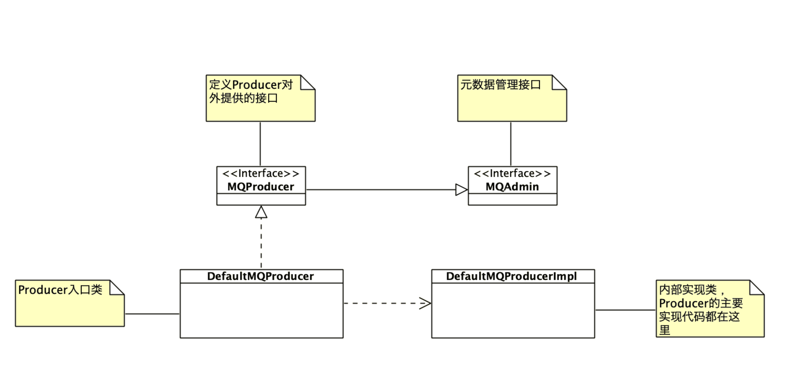
使用设计模型：

门面模式（Facade Pattern）：门面模式主要的作用是给客户端提供了一个可以访问系统的接口，隐藏系统内部的复杂性。

其中类 `DefaultMQProducer` 实现了接口 MQProducer，它里面的方法实现大多没有任何的业务逻辑，Producer 的大部分业务逻辑的实现都在类 `DefaultMQProducerImpl` 中。

启动过程：
- 执行init（）：创建一个 DefaultMQProducer 的实例，为它初始化一些参数，然后调用 start 方法启动它。在start方法中RocketMQ 使用一个成员变量 serviceState 来记录和管理自身的服务状态。使用设计模式：  
状态模式 (State Pattern)：允许一个对象在其内部状态改变时改变它的行为，对象看起来就像是改变了它的类。
```java
@Before  
public void init() throws Exception {
    String producerGroupTemp = producerGroupPrefix + System.currentTimeMillis();      

producer = new DefaultMQProducer(producerGroupTemp);     
producer.setNamesrvAddr("127.0.0.1:9876");      
producer.setCompressMsgBodyOverHowmuch(16);       
// 省略构造测试消息的代码       
producer.start();       
// 省略用于测试构造 mock 的代码  
}
```
- 调用producer.start()方法

```java
public void start(
    final boolean startFactorythrows MQClientException {    
        switch (this.serviceState) {        
            case CREATE_JUST:     this.serviceState = ServiceState.START_FAILED;             
            // 省略参数检查和异常情况处理的代码             
            // 获取 MQClientInstance 的实例 mQClientFactory，没有则自动创建新的实例           
            this.mQClientFactory = MQClientManager.getInstance().getAndCreateMQClientInstance(this.defaultMQProducer, rpcHook);            
            // 在 mQClientFactory 中注册自己            
            boolean registerOK = mQClientFactory.registerProducer(this.defaultMQProducer.getProducerGroup(), this);            
            // 省略异常处理代码             
            // 启动 mQClientFactory            
            if (startFactory) {                
                mQClientFactory.start();            
            }            
                this.serviceState = ServiceState.RUNNING;            
                break;case RUNNING:        
                case START_FAILED:        
                case SHUTDOWN_ALREADY:            
                // 省略异常处理代码        
                default:  
                    break;    
            }    
                // 给所有 Broker 发送心跳    
                this.mQClientFactory.sendHeartbeatToAllBrokerWithLock();
}

```

其中`mQClientFactory` 对应的类 `MQClientInstance`(单例模式) 是 RocketMQ 客户端中的顶层类，为每个客户端对应类 `MQClientInstance` 的一个实例。这个实例维护着客户端的大部分状态信息，以及所有的 Producer、Consumer 和各种服务的实例。

```java
// 启动请求响应通道
this.mQClientAPIImpl.start();
// 启动各种定时任务
this.startScheduledTask();
// 启动拉消息服务
this.pullMessageService.start();
// 启动 Rebalance 服务
this.rebalanceService.start();
// 启动 Producer 服务
this.defaultMQProducer.getDefaultMQProducerImpl().start(false);

```
其中 Producer 的启动流程：

- 启动实例 mQClientAPIImpl，其中 mQClientAPIImpl 是类 MQClientAPIImpl 的实例，封装了客户端与 Broker 通信的方法；
- 启动各种定时任务，包括与 Broker 之间的定时心跳，定时与 NameServer 同步数据等任务；
- 启动拉取消息服务；
- 启动 Rebalance 服务；
- 启动默认的 Producer 服务。


其中：

- DefaultMQProducerImpl：Producer 的内部实现类，大部分 Producer 的业务逻辑，也就是发消息的逻辑，都在这个类中。
- MQClientInstance：这个类中封装了客户端一些通用的业务逻辑，无论是 Producer 还是 Consumer，最终需要与服务端交互时，都需要调用这个类中的方法；
- MQClientAPIImpl：这个类中封装了客户端服务端的 RPC，对调用者隐藏了真正网络通信部分的具体实现；
- NettyRemotingClient：RocketMQ 各进程之间网络通信的底层实现类。


## 消息发送
在 Producer 的接口 MQProducer 中，按照发送方式不同可以分成三类：

单向发送（Oneway）：发送消息后立即返回，不处理响应，不关心是否发送成功；

同步发送（Sync）：发送消息后等待响应；

异步发送（Async）：发送消息后立即返回，在提供的回调方法中处理响应。（已经被弃用）


# 12. Kafka消息消费
todo https://mp.weixin.qq.com/s?__biz=MzIxMjQxMDE5OA==&mid=2247484113&idx=1&sn=2b25233da3be395cfcff21549126522f&chksm=9747c8e8a03041fe4273801f8b00df8b6fd5597442ce47aaf5361475389bbee1e92c1bbd4aae&scene=21#wechat_redirect


# 13 消息复制
面临问题：
- 高性能：写入节点越多，可用性与可靠性越好，但写入性能越低。
- 一致性：不丢消息，保证顺序，需采用主从模式。数据只能写入主节点，从节点只从主节点复制数据，如果出现数据不一致情况，比如以主节点为准。
- 高可用：当某个主节点宕机时，尽快选举一个主节点接替。可以使用第三方管理服务或者自选举进行投票（比较慢）。如果采用“一主二从三副本”集群模式，只要保证写入两个副本就认为写入成功（一主一从），可以容忍一个从节点宕机。

**目前没有一种完美方案能兼顾高性能、高可用和一致性。**


### RocketMQ：
Broker：复制的基本单位是Broker，即服务端的进程。
1. 复制方式
- 异步复制：
消息先发送到主节点（Master），立即返回“写入成功”。消息再异步复制到从节点（Slave）。需要的副本数为1。
- 同步双写：
消息同步写入主从节点（Master和Slave）。主从都写成功后，才返回“写入成功”。需要的副本数为2。
2. 主从关系
Broker的主从关系是通过配置固定的，不支持动态切换。
如果主节点宕机，生产者不能再生产消息，发送消息没有回应，超过重试次数。
消费者可以自动切换到从节点继续消费。

3. 异步复制的数据安全：
即使在异步复制模式下，消息也不会丢失：RocketMQ支持同步刷盘和异步刷盘两种策略。同步刷盘是在消息写入后立即将数据从内存刷到磁盘，确保消息的持久性。异步刷盘则是由操作系统决定何时将数据刷到磁盘，性能更高但持久性稍差。
主节点宕机恢复后，消息可以继续复制到从节点并继续消费。

4. 磁盘存储： 

- CommitLog：RocketMQ将所有消息顺序写入一个称为CommitLog的文件中。CommitLog是消息存储的核心文件，所有的消息都会首先写入这个文件。
- ConsumeQueue：为了提高消息消费的效率，RocketMQ还会为每个主题（Topic）和每个队列（Queue）创建一个ConsumeQueue。ConsumeQueue是一个索引文件，记录了消息在CommitLog中的物理位置。

- RocketMQ使用内存映射文件（MappedFile）技术，将磁盘文件映射到内存中。这使得消息的读写操作可以通过内存完成，从而提高了性能。


**牺牲了可用性，换取了比较好的性能和数据一致性。**

可用性：
Dledger机制： 在写入消息的时候，要求至少消息复制到半数以上的节点之后，才给客户端返回写入成功，并且它是支持通过选举来动态切换主节点的。

当主节点宕机的时候，2 个从节点会通过投票选出一个新的主节点来继续提供服务，相比主从的复制模式，解决了可用性的问题。由于消息要至少复制到 2 个节点上才会返回写入成功，即使主节点宕机了，也至少有一个节点上的消息是和主节点一样的。Dledger 在选举时，总会把数据和主节点一样的从节点选为新的主节点，这样就保证了数据的一致性，既不会丢消息，还可以保证严格顺序。

### Kafka 
复制的基本单位是分区，每个分区的几个副本之间（位于不同的broker），构成一个小的复制集群，Broker 只是这些分区副本的容器。

ZooKeeper 来监控每个分区的多个节点，如果发现某个分区的主节点宕机了，Kafka 会利用 ZooKeeper 来选出一个新的主节点，这样解决了可用性的问题。

选举的时候，会从所有 ISR 节点中来选新的主节点，这样可以保证数据一致性


# 14. Zookeeper in Kafka
Kafka 主要使用 ZooKeeper 来保存它的元数据、监控 Broker 和分区的存活状态，并利用 ZooKeeper 来进行选举。


1. 保证数据一致性
- UNIX 文件系统的树形结构，每个节点被称为一个“ZNode”，如果创建临时节点的客户端与 ZooKeeper 集群失去连接，这个临时节点就会自动消失。在 ZooKeeper 内部，它维护了 ZooKeeper 集群与所有客户端的心跳，通过判断心跳的状态，来确定是否需要删除客户端创建的临时节点。
- 订阅 ZNode 状态变化的通知机制：Watcher，一旦 ZNode 或者它的子节点状态发生了变化，订阅的客户端会立即收到通知。

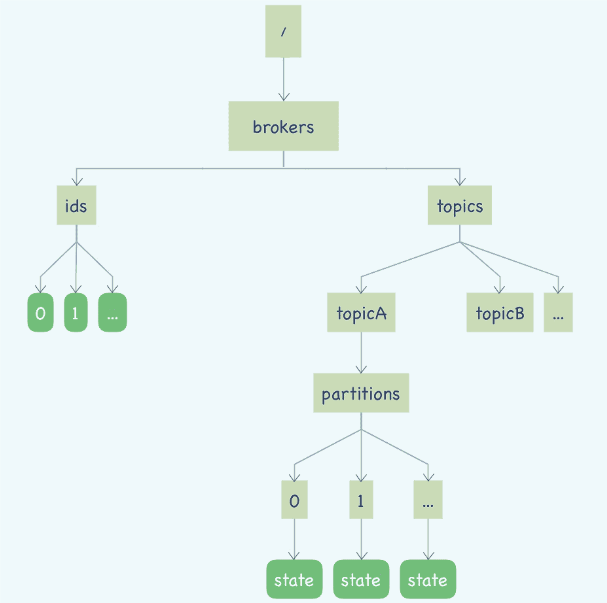

左侧这棵树保存的是 Kafka 的 Broker 信息，/brokers/ids/[0…N]，每个临时节点对应着一个在线的 Broker，Broker 启动后会创建一个临时节点，代表 Broker 已经加入集群可以提供服务了，节点名称就是 BrokerID，节点内保存了Broker 的基本信息。

右侧部分的这棵树保存的就是主题和分区的信息。

- **client如何找到对应的Broker？**

    先根据主题和队列在右边子树找到对应的state节点，获取Leader的Broker ID以后再去左侧的树找到BrokerID对应的节点获得Broker的访问地址。


state 的临时节点，节点中保存着分区当前的 leader 和所有的 ISR 的 BrokerID
2.提供了包括读写元数据、节点监控、选举、节点间通信和分布式锁等很多功能。

3. Kafka 的客户端并不会去直接连接 ZooKeeper，它只会和 Broker 进行远程通信，ZooKeeper 上的元数据应该是通过 Broker 中转给每个客户端的。


4. 注意：
- 不要往 ZooKeeper 里面写入大量数据。它不是一个真正意义上的存储系统，只适合存放少量的数据。ZooKeeper 在写入超过几百 MB 数据之后，性能和稳定性都会严重下降。
- 不要让业务集群的可用性依赖于 ZooKeeper 的可用性，要考虑如果 Zookeeper 集群宕机了，你的业务集群最好还能提供服务。因为 ZooKeeper 的选举过程和网络抖动，是不能提供任何服务的。

- Kafka 在 ZooKeeper 中保存的元数据，主要就是 Broker 的列表和主题分区信息两棵树。这份元数据同时也被缓存到每一个 Broker 中。客户端并不直接和 ZooKeeper 来通信，而是在需要的时候，通过 RPC 请求去 Broker 上拉取它关心的主题的元数据，然后保存到客户端的元数据缓存中，以便支撑客户端生产和消费。

- 所以kafka严重依赖Zookeeper，可以拆分成多个相互独立的小集群部署，每一个小集群都有一组独立的ZooKeeper提供服务，这样就算某个ZooKeeper宕机，只会影响一个小的Kafka集群。


# 15.Kafka事务
todo https://javabetter.cn/sidebar/sanfene/rocketmq.html#_1-%E4%B8%BA%E4%BB%80%E4%B9%88%E8%A6%81%E4%BD%BF%E7%94%A8%E6%B6%88%E6%81%AF%E9%98%9F%E5%88%97%E5%91%A2

https://matt33.com/2018/11/04/kafka-transaction/

https://www.cnblogs.com/crazymakercircle/p/14367425.html


 


